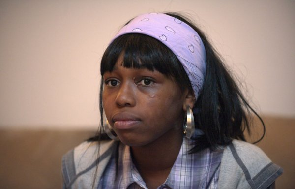
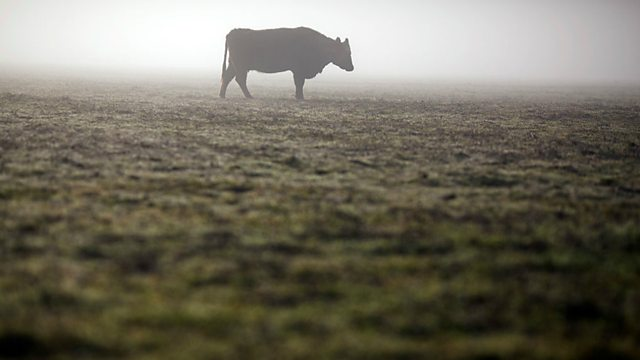
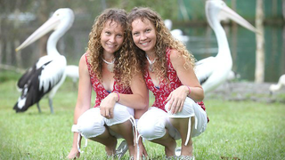

# 絲綢之路上的傳染病
[Silk Road Transported Goods--and Disease](http://www.scientificamerican.com/podcast/episode/silk-road-transported-goods-and-disease/)

<audio src="file/160729SilkRoadDisease.mp3" controls="controls">
Your browser does not support the audio element.
你的瀏覽器不支持音頻播放。請使用chrome科學上網。
</audio>

听写于：2016-10-6 12:2	用时：68:10
正确率：91%	错词：43个

<!--我的听写开始-->
提示：红色：错误单词，绿色：补上正确单词，黄色：纠正大小写与标点
                                                                                                                 
For thousand thousands of years, what's called the Silk Road was a group of lands land and sea trade routes that connected the Far East with South Asia, Africa, the Middle East , and southern Europe. Of course, when humans travel , they carry their pathogens with them. So scientists and historians have wondered if the Silk Road was a transmission route , not just for goods, but for infectious disease. 

Now we have the first hard evidence of ancient Silk Road travelers spreading their infections. The find comes from a 2000-year-old 2,000-year-old latrine , that had first been excavated in 1992. The report is in the Journal of Archaeological Science: Reports. 

So the site is a relate relay station on the Silk Road in northwest China. It's just to the eastern end of the Tarim Basin, which is a large and varied arid area . It's just to the east of the Taklamakan desert, and not far from the Gobi Desert. So this is a dry part of China. 

Piers Mitchell, a paleopathologist , at the University of Cambridge, and one of the study's authors, along with a his student Ivy Yeh and colleagues in China. 

In the latrine, archaeologists found used hygiene sticks rap wrapped with clothescloth. These were used for what you think they were used for. 

This escalation excavation was great . because the clothes were cloth was still preserved in and the fezzes which feces was still adherent to the clothes cloth on some of the sticks. So the archaeologists tagged archaeologist kept these sticks in the museum. And so my Ph. D. student, Ivy Yeh, who is the who's first author of on the paper. , she went out to China took some scrapings from the fezzes feces adherent to the clothes cloth. So we were then able to analyze that down the microscope when she brought it back to Cambridge. 

Where they found legs eggs from parasites - including one from a liver fluke. 

And that's the exciting one because that's only found in East eastern and southern China and in Korea. , where they have marched the marshy areas that would have the right snails and the right fish. 

The fluke needs snails and fish for its lifecycle. , but there were no such snails or fish in this dry region of China. So the unlucky travelers traveler who harbored the parasite had to have transported the disease to that spot. 

Well , firstly it tells us that people were doing a very long journey, journeys along the long Silk Road . and you might think that's obvious. But no one really knew how long people were traveling. Some people may have been trading, don't need to go only going short distances selling their goods on to the next person. And so the goods might have gone all over the way on along the Silk Road, but people might not. But we know that some people were doing huge distances. 

Secondly , it shows that you know this was, would be a viable route for the spread of those other infectious diseases like Bubonic plague , and leprosy , and anthrax . that people had previously been suggested might have been spread between East Asia and Europe along the Silk Road. Because bone modern genetic analyses have just shown similarities between the strains of one end and the other. 

Mitchell says there is there's much more work to be done to better understand the spread of diseases around the world. Perhaps from analyzing skeletons - or various other kinds of remains - to be found along the Silk Road.

* _Words_ worth to be remembered:
    * latrine: `n. a public toilet in a military area`
    * relay: `n. 接力赛；替班；中继设备；转播，传送 v. 传达；转播，传送；（使）接替`
    * arid: `adj. 干旱的，干燥的；贫瘠的，不毛的；枯燥无味的`
    * archaeologist: `n. 考古学家`
    * excavation: `n. 挖掘，发掘；挖，开凿`
    * Taklamakan desert: `塔克拉玛干沙漠`
    * feces: `n. 排泄物，渣滓`
    * Gobi Desert: `戈壁沙漠（蒙古和中国西北部）`
    * marshy: `adj. 多沼地的，湿地的，沼地的`
    * Bubonic plague: `n. [医]黑死病,淋巴腺鼠疫`
    * leprosy:  `n. 麻疯病,腐败`
    * athrax: `n. 炭疽热`

## 譯文
几千年前， 有个被称为丝绸之路的地方就是一段陆地和海洋上的贸易路线图，贯穿远东和南亚，中东以及欧洲南部。 当然，那时候人们在旅途中也是会携带者病菌的。所以，科学家和历史学家早就好奇，是不是丝绸之路不仅仅是贸易通商之路，还是传染性疾病的传播之旅阿。

如今，我们找到第一手资料能够证明古老的丝绸之旅上的商旅们确实也传播了他们感染的传染病。这些证据来自于1992年首次挖掘出的一个具有2000年的公厕。该研究报告已经发表在《考古科学：通报》杂志上。

所以这个位点是一个中国西北部丝绸之路上的一个驿站。它通往塔里木盆地的东部末端，是通往塔克拉玛干沙漠东部的一片较大的草木荒芜地区， 离戈壁滩不是很远。所以这里是中国的一块非常干燥的土地。

这是Piers Mitchell,剑桥大学的一位古生物病理学家，也是这项研究的作者之一，其它参与者是他的学生Piers Mitchell,和中国的一些同事。在这个公厕里，考古学家们发现了使用过的包裹着布料的卫生棒。这些东西就是你想象中的需要用到的那些东西。

这次挖掘的意义重大，因为，织物的保存还是完好的，而粪便仍然还粘附在棒子上的布料上的某些地方。所以考古学家们把这样的一些棍子保存在了博物馆里。并且因此我的博士生Ivy Yeh, 他就是这篇文章的第一作者，她就去中国从那些布料上刮下了一些粪便样品。当她回到剑桥之后，我们才能用显微镜观察分析。他们发现了一些寄生虫的卵——包括一种肝吸虫。

因为这种东西只在东部和南部的中国以及韩国存在，所以这个发现还是令人兴奋的。那些地区 都有沼泽地区，里面生存着合适的宿主蜗牛和鱼类。这种肝吸虫的生活史中需要蜗牛和鱼类，但是在这些干燥的中国地区是没有这类蜗牛和鱼类的。所以，被寄生的这些不幸的旅行者们不得不把这种疾病带到了这个站点。

首先，这告诉我们，人们在丝绸之路上行走了相当长的一段距离，并且，你也许认为这还不时很显然的事情吗。但是，没有人真正了解人们具体行走了多长的距离不是吗。一些人也许一直会做着贸易，只走了较短的距离后就把他们的货物卖给下一个人。而这些货物也许被运送了全程，而人们就不一定都走了全程的。但是我们子回到有些人确实走了很远的距离。

第二点，这表明，这是，也许是传播像 Bubonic plague腺鼠疫，麻风病和炭疽热等其它类传染性疾病的一个可行的途径，这些疾病人们以前曾经假设过也许就是在中亚和欧洲地区沿着丝绸之旅开始流行传播的。因为现代遗传分析已经显示出在这条路一端和另外一端的菌株之间的遗传相似性。

Mitchell 表示，还有很多工作需要做，这样将有助于更好的理解全世界的疾病传播情况。或许是通过分析遗迹残骸骨架——或者其它种类的残留物——未来在丝绸之路上所发现的那些东西，就可以了解了。

# 吃魚油的魚
[Farmed Trout Bred to Fatten Up Fast](https://www.scientificamerican.com/podcast/episode/farmed-trout-bred-to-fatten-up-fast/)

<audio src="file/160706VeggieFish.mp3" controls="controls">
Your browser does not support the audio element.
你的瀏覽器不支持音頻播放。請使用chrome科學上網。
</audio>

听写于：2016-10-7 18:36	用时：20:18正确率：91%	错词：24个

<!--我的听写开始-->
提示：红色：错误单词，绿色：补上正确单词，黄色：纠正大小写与标点

Half of all fish people eat worldwide now come from fish farms. So farms need to do more to keep up with demand. 

And If we look to the future, at today's per capital capita fish intake around the world . we will would need to double aquaculture production. 

Ron Hardy is the University of Idaho's Director of Aquaculture Research. He presented his research at a the recent International Symposium on Fish Nutrition and Feeding in Sun Valley, Idaho, which him he also chaired. 

In the wild, rainbow trout eat insects and other, smaller fish. But Hardy says there aren't enough little fish to feed larger fish in the wild and still meet market demand as the human population increases. So he's used selected selective breeding to create strains of farmed fish that get by on food that's less expensive than little fish . - feed made from soybeanscorns , corn and weedwheat. 

Some of the farmed fish really thrived. thrive: 16 years ago, Hardy had to wait a year for a one-pound  trout. These days, his efforts yield trout up to four times as large in the same amount of time. 

So, it become like would be kind of like if you are were going to you know breed a, I don't know , box ? dogs. So we've got everything from Rottweilers to , you know , little Scotties or whatever. 

But the farmed fish aren't are not completely vegetarian. Soybeans don't have skeletons, they don't have bones . and the bones in fish meal are a major source of mineral minerals for the fish, for example. And much like humans, fish diets require omega-3 fatty acids, not found in terrestrial plants. So Hardy has to add a little fish-oil  back into the plant-based feed. For those of us without waiterswaders, this kind of aquaculture is our best shot at a fish fry.

<!--我的听写结束-->

* _Words_ worth to be remembered:
    * aquaculture: `n. 水产养殖；水产业`
    * get by: `phr. 过得去；过活；通过`
    * trout: `n. 鳟鱼，鲑鱼`
    * wader: `n. 步涉者，涉禽类，钓鱼用的防水长靴`

## 譯文

全世界的人消费的所有鱼类中,有一半现在都来自于渔场.所以渔民们需要更努力工作来保证供给.如果从长计议, 按照当今全世界的人均鱼类消费水平来看,未来水产养殖业的产量需要达到翻倍才可以供应的上.

这是Ron Hardy, University of Idaho水产养殖研究的负责人.他最近在Idaho 的太阳山谷Sun Valley举行的渔业营养与养殖国际论坛上发表了他的相关研究, 他同时也是这次会议的主席.

在野生地区, 红鳟鱼吃昆虫或者是其它小鱼.但是Hardy说, 在野生环境中可没有那么多小鱼供应给大一点的鱼, 随着人类数量的增加, 也没有那么多供应给人类. 所以他就选择性的 用比小鱼便宜的食物饲养人工鱼苗——就是用大豆，玉米和小麦做成的鱼食。

有些鱼苗大量繁殖成功：16年前，Hardy 不得不需要等一年才能得到一个一磅重的鳟鱼。近年来，他的努力所得到的鳟鱼，在同样的养殖时间内在体格上已经达到原来的四倍。所以，比如说你之前饲养的是小狗， 那么我们现在已经有从德国Rottweilers 罗特韦尔犬到小型苏格兰犬等各种品种了。

但是，渔场的鱼并不是完全素食的。大豆没有骨架，它们没有骨头而鱼食中的骨头是鱼类所需的比如说矿物质的主要来源。

和人类十分相似的是，鱼的膳食中也需要欧米伽3不饱和脂肪酸，这在陆地植物中是不含有的。所以，Hardy不得不在植物性的鱼食中再添加一点儿鱼油。**对于我们那些不是捕鱼高手的人来说**，这种水产品可是我们在选择炸鱼食品中最好的选择了吧。

# 挑食的蚊子
[Some Malaria Mosquitoes May Prefer Cows to Us](https://www.scientificamerican.com/podcast/episode/some-malaria-mosquitoes-may-prefer-cows-to-us/)

<audio src="file/160919MosquitoMeals.mp3" controls="controls">
Your browser does not support the audio element.
你的瀏覽器不支持音頻播放。請使用chrome科學上網。
</audio>

听写于：2016-10-13 23:22	用时：24:08
正确率：90%	错词：20个

<!--我的听写开始-->
提示：红色：错误单词，绿色：补上正确单词，黄色：纠正大小写与标点

As you've probably experienced first hand firsthand, some mosquitos mosquito species have a real taste for warm, human blood. So much so that if you raise them on in a it the labexcept , they'll accept no substitute. 

Fortunately, I don't get a major reaction reactions at all. Brad Main is a mosquito geneticist at U. C. Davis . and part-time  mosquito meal provider. So it's not too bad for me. But some people in the lab are itching . pretty bad when they have hundreds of mosquito bite bites on their arms. 

Out in the wild, some species are less picky. Take Anopheles arabiensis, common in East Africa. They will They'll feed on cattle, dogs, goats, pigs, people , - wherever they can find a warm meal. But what Main and his colleagues wanted to know was whether the blood suckers bloodsuckers' choice a of victim might be genetically determined. So they sequenced the genomes of 48 arabiensis mosquitos mosquitoes from Tanzania , which had fed on either humans or cows. 

And they found that bugs with cow blood in their bellies had one partially rearranged chromosome, compared to those who who'd snacked on human blood , which could explain the preferences in meal choicechoices. The study is in the journal PLoS Genetics. 

If that genetic switch really does make cows more attractive than we are to mosquitos. mosquitoes, in theory , we can could genetically engineer them to steal steer clear of people. And their cow victims don't get human malaria. It's a case of knowing your enemy . and so , the better we know these mosquitosmosquitoes, I think, the more equipped we will gonna we're going to be to be able to control them.

<!--我的听写结束-->

* _Words_ worth to be remembered:
    * fisthand:`adj. 直接的,直接得来的,直接采购的 adv. 直接地`
    * anopheles:`按蚊,按蚊属`
    * steer:`v. 行驶；掌舵；引导；控制`
    * so much so:`以至于`

## 譯文
因为你也许已经亲身经历过了，某些种类的蚊子品尝到了温暖的人类血液。太多次以至于如果你要在实验室里饲养它们，它们什么其它食物都是不吃的。所幸的是，我没有碰到过剧烈的反应。这是加州大学U.C. Davis分校的一位研究蚊子的遗传学家，他还兼职做蚊子的食物供应商。所以对我来讲还不是太差。但是当被几百只蚊子咬过之后，实验室中的某些人可是会感到非常痒的。

在野外，某些种类的胃口还不是很挑剔。 就拿东非地区常见的阿拉伯按蚊来说吧。它们会咬牛，狗，山羊，猪， 和人——只要它们能发现这是一顿温暖的食物。但是，Main和他的同事们想知道是否这些吸血鬼对食物挑剔的结果其实是遗传决定的。所以他们对从坦桑尼亚捉来的已经尝过人或者小牛的血液的48种按蚊。

结果他们就发现，对比已经尝过人学的蚊子，吃过牛血的这种蚊子含有部分重组过后的染色体，这就可以解释为何有些蚊子会有食物偏好。该研究已发表在《公共科学图书馆：遗传学》杂志上。

如果，遗传转换真的使得牛比人类 对这些蚊子更有吸引力的话， 理论上我们能对它们进行遗传修饰以便人类完全引导它们的生活史。而被咬的牛是不会得疟疾的。这只是了解你的对手的一个机会。 所以，我们对这些蚊子了解的约多，我们将会更好的对它们进行掌控。

# 用愛治愈傷痛

**爲了準備IELTS雅思英語考試, 此篇文章之後的聽寫計劃盡量加入BBC英音的音頻資料.**

[Aleppo's underground orphanage](http://www.bbc.co.uk/programmes/p04bsysm)

<audio src="file/aleppos's underground orphanage.mp3" controls="controls">
Your browser does not support the audio element.
你的瀏覽器不支持音頻播放。請使用chrome科學上網。
</audio>

听写于：2016-11-10 15:38	用时：21:18
正确率：96%	错词：13个

<!--我的听写开始-->
提示：红色：错误单词，绿色：补上正确单词，黄色：纠正大小写与标点

The rebel-held part of the city of Aleppo is currently under siege from Russian and Syrian government forces . and, according to the UN Special Envoy, faces total ruined ruin within the next two months. Before the war, Asmar Halabi ran two furniture shops in the city with his father, . These have been destroyed by the shelling. Now he runs an orphanage which is home to 50 children, many of whose parents have been killed in the bombardment. And it's not just the children who've lost relatives. , Asmar's own father and 3 three of his 4 four sisters have also been killed. On the line from Aleppo , he told me about the day in 2014 when an air strike hit the schools school where 2 two of his sisters and the women woman who is now his wife were studying. 

There was an exhibition for paintings and drawings for children above the age of 13. , and it's it also was the end of the academic here. year and there was some sort of celebration. At that time the school was attacked by regime forces and the whole school was destroyed. I got the news at around 9: 30 in the morning. People called me and told me of the incident. I immediately rushed to the school. I was able to find one of my sisters, killed. The second one, I kept looking for her under the rubbles and ruins for 2 two to 3 three hours until I was able to find any traces of her, and I couldn't. And then eventually they told me that she is in the hospital and we found her there. She was killed in that strike. My wife, we looked for her for days and days . and we couldn't find here her for 4 four days until later on they called us in the hospital and they told us that she was found in the school at that time and she was taken to hospital.

<!--我的听写结束-->

* _Words_ worth to be remembered:
    * Aleppo: `阿勒颇[叙利亚西北部城市]`
    * under siege: `被包围；受...困扰的；一再遭到批评的`
    * envoy: `n. 使节，外交官；全权公使`
    * shelling: `n. 壳；外壳；外形；炮弹 v. 剥壳；剥落`
    * bombardment: `n. 炮击，轰炸`
    * regime force: `政府军`

## 譯文
据联合国特使称，叛军控制的阿勒颇市部分地区目前正处于俄罗斯和叙利亚政府军的包围之下，并将在接下来的两个月中变得满目疮痍。战争开始前，阿斯马尔·哈拉比和父亲在市内经营了两家家具店，但是都被炮击摧毁。目前他开了一家孤儿院，收养了50个孩子，他们中很多人的父母都在轰炸中丧生。失去亲人的不光是孩子们，阿斯马尔的父亲和他四姐妹中的三人也都不幸遇难。远在阿勒颇的他向我讲述了2014年学校遭受空袭那天的事，当时他的两个姐妹和他现在的妻子正在那里上学。 那时有一个13岁以上孩子参加的画展，那也是学年结束的日子，所以有一些庆祝活动。当时学校被执政势力袭击，整个校园被毁。我是在早上9点半左右得到的消息。有人打电话告诉我这件事。我立刻赶往学校，找到了其中一个不幸丧生的姐妹。我在废墟和瓦砾中一直寻找我另一个姐妹，找了两三个小时也没找到她的踪迹。后来他们告诉我她在医院，我们在那里找到了她。她已经在袭击中身亡。我们整日地寻找我的妻子，四天过去都没找到，直到后来他们给我们打电话，说她在学校被发现，当时就被送进了医院。

# 歐盟加拿大籤署自由貿易協定

[Canada and EU sign free trade deal](http://www.bbc.co.uk/programmes/p04dntqj) 

 

<audio src="file/canadian-EU.mp3" controls="controls">
Your browser does not support the audio element.
你的瀏覽器不支持音頻播放。請使用chrome科學上網。
</audio>

听写于：2016-11-11 16:48	用时：20:05
正确率：90%	错词：19个

<!--我的听写开始-->
提示：红色：错误单词，绿色：补上正确单词，黄色：纠正大小写与标点

After 7 seven years of negotiation and 7 seven days of at the bulging Belgian region of Wallonia digging that hills their heels in over approving the deal. , the European Union and Canada have finally signed that their landmark free trade agreement. After a short, but possibly in the circumstances, appropriate delay. , the Canadian Prime Minister Justin Trudeau flew into Brussels , for the signing ceremony. Those applauds There was applause and jubilation ask as ink was finally put to paper. 

Well in his comments, Mr . Trudeau concentrated on the economic benefits of the deal. 

First and foremost. , Canadians and Europeans share the understanding that in order for a real and meaningful economic growth . we need to create more good, well-paying jobs for our citizens. For aggressive Progressive trade agreements like the one signed today will do just that. 

While Well the European Council President Donald Tusk gave it a far broader significance. 

Todays' Today's decisions demonstrate that the disintegration of the Western community does not need to become a lasting trend. 

, that we still possess enough strength and determination, at least some of us, to counter the fatalism of the decay of our political worldsworld. In this particular moment in the EU's history , this positive sign means a great deal.
 <!--我的听写结束-->

* _Words_ worth to be remembered
    * digging their heels in `顽抗；拒绝让步；坚持自己的立场 例句：Officials dug their heels in on particular points. 在一些特定问题上,官员们拒不让步. `
    * jubilation: `n. 欢腾，欢庆，庆祝活动`
    * Belgian: `adj. 比利时的 n. 比利时人`
    * _as ink was finally put to paper_ `签字的那一刻`
    * progressive: `adj. 进步的; 不断前进的; 进行的; n. 改革论者; 进步分子; 例句：The company tries to project an image of being innovative and progressive. 该公司努力以富有创新和进取精神的形象出现。`
    * disintegration: `n. 瓦解，崩溃；分解`
    * integration: `n. 整合; 一体化; 结合; （不同肤色、种族、宗教信仰等的人的） 混合; 例句：The aim is to promote closer economic integration. 目的是进一步促进经济一体化。`
    * fatalism: `n. 宿命论`
    * broader significance: `更深远、更广泛的意义`

## 譯文
经过长达七年的谈判和比利时的瓦隆地区七天的不签约风波，欧盟和加拿大终于签订了历史性的的自由贸易协定。在短暂（又正合时宜）的延误之后，加拿大总理贾斯廷·特鲁多飞往布鲁塞尔，参加签署仪式。签字的那一刻，全场欢呼，掌声雷动。

特鲁多先生的发言着重强调协定带来的经济效益。

首先，加拿大和欧洲都深知，为了真实而有意义的经济增长，我们需要为市民们创造更好、待遇更优厚的工作机会。积极的贸易协定(指签署的自贸协定)有助于实现这一目标。

而欧洲理事主席多纳尔德·图斯克赋予了该项协议更深远的意义。

今天的决议体现了西方社会的分崩离析并非大势所趋，因为至少我们当中仍有一部分人，有着足够的力量和决心，去反抗政治世界衰败消亡的宿命。在欧盟历史上这个特殊的时刻，这个积极的信号意义非常重大。

# 日以作夜

[Jacqueline Bisset](http://www.bbc.co.uk/programmes/b08015rw)

<audio src="file/nocturnal.mp3" controls="controls">
Your browser does not support the audio element.
你的瀏覽器不支持音頻播放。請使用chrome科學上網。
</audio>

 
听写于：2016-11-12 10:47	用时：27:26
正确率：88%	错词：25个

<!--我的听写开始-->
提示：红色：错误单词，绿色：补上正确单词，黄色：纠正大小写与标点

We are We're beginning with one of the most popular and affections infectious examples of the Jone genre from 1963. 1973, because it's there's a new Blu-ray release of Francois Truffaut's Day For Night, which takes it's its title from the blue filter used to make daylight look nocturnal . - a whole lot easier than filming in genuine dark. The plot dancers surrounded dances around the director played by Truffaut himself, as he tries to marshal his production despite the various personal dramas of costume cast and crew. His film was is made in France, in French, but his star is English. She arises arrives from Hollywood in the a flurry of paparazzi, young, beautiful and slightly neurotic. The in-joke here is the that star Pamela is played by British actress Jacqueline Bisset, who would indeed be have been arriving with attendance attendant publicity. By the early 70s, she'd already been a Bond girl, Steve McQueen's love interesting interest in Bullitt and an air hostess and Captain Dean Martin's girlfriend in Paro peril in the sky blockbuster Airport. And then, one day in 1972, Jacqueline Bisset was in Paris - not so much for the last tango with as the disco tech , - when an emissary arrived from UAE royalty. 

It's actually rather a strange story, from my point of view. I was in Paris as I used to go sometimes quite often, and I often used to go to a place and dance. And I was staying that particular evening in a hotel I've I'd never stayed at before in my life. , and about 11 : 00 o'clock in the morning. , a very out-of-breath handsome young man came rushing up the stairs, knocking on my door, sayingthere is , you must, there's a phone call for meyou. I saidthere is , no, there's a mistake, . Nobody knows I am I'm here.

<!--我的听写结束-->

* _Words_ worth to be remembered:
    * genre: `adj. 风俗画的 n. 种，类；类型；（文学作品等的）体裁，样式，风俗画:
I believe in the story of the genre itself.
我相信这种音乐流派本身的故事。`
    * nocturnal: `adj. 夜间的；夜行性的`
    * marshal: `n. 元帅；司仪；警察局长；消防队长 v. 排列，整理；引领；集结，编队: If so, you're a leader who will take your company to new levels and marshal all the resources(and personalities) of a team destined for success.
倘是如此，你将是一个引领你的公司走上新台阶、合理配置团队资源（包括人力资源）以驶向成功彼岸的领导者`
    * cast and crew: `演员和工作人员`
    * a flurry of paparazzi: `一连串的狗仔队`
    * flurry: `n. 一阵风、雨或雪；疾风；骚动；慌张 v. （使）慌张，激动  Why the flurry?
这么慌张干嘛？`
    * paparazzi: `n. 专门追逐名人的摄影记者`
    * in-joke: `n. 圈内人(才能领会)的笑话`
    * peril: `n. 危险；冒险 v. 危及`
    * blockbuster: `n. 重磅炸弹，大片，畅销书: The difference between us and a Hollywood blockbuster is that we have to keep it tied to the science as closely as possible.
我们创作出来的作品与好莱坞大片之间的不同点在于，我们的东西总是尽可能的贴近现实科学。
`
    * emissay: `n. 使者；间谍；密使 adj. 间谍的；密使的: Now spring coming, a couple, bride and bridegroom, like a spring emissary is standing happily before us with the wedding music playing on.
春天来了，一对春天的使者，踏着婚礼进行曲正含情脉脉立在大家面前。`
    * UAE: `abbr. 阿拉伯联合酋长国（United Arab Emirates）`
    * out-of-breath: `喘不过气来，上气不接下气`
    * attendant `adj. 伴随的；侍候的:
Such patients run an increased probability of hospitalization, with all the attendant costs to the patient and to the health care system that hospitalization entails.
此类患者趋于住院治疗的的几率增加，随之而来的患者和医疗保健系统住院治疗所承担的费用也增加。`

## 譯文
我们先来看看这一类电影中最受欢迎且最有感染力的一部作品，导演Francois Truffaut在1973年的作品《日以作夜》。这部电影最近发行了最新的蓝光版本。电影得名于拍摄时采用的蓝色滤镜。滤镜让白天看起来像是夜晚，比在黑暗中拍摄容易得多。电影情节围绕着一位导演展开，讲述他如何克服剧组里的一系列戏剧性事件，只为完成电影的拍摄。Truffaut本人扮演这一角色。导演的法语电影拍摄于法国，但主角是英国人。她年轻貌美，又有点神经质，从好莱坞来到这里，轰动了一众狗仔。这里有个行内人才懂的笑点：片中的女星Pamela由英国演员Jacqueline Bisset扮演，她本人的出现确实会引起广泛关注。在70年代初，她已饰演过邦女郎，导演Steve McQueen的作品《布利特》中的情人，以及风靡一时的电影《国际机场》中机长Dean Martin的空乘女友。随后，1972年的一天，Jacqueline在巴黎（并不是像歌里唱的那样“为了最后一曲探戈”），一位来自阿联酋皇室的信使找到了她。

在我看来，这真的是一件非常不可思议的事。我那时在巴黎。我以前常去那里，也常去一个地方跳舞。在那个特别的晚上，我住在一间我从未住过的酒店。早上11点左右，一位帅得让人窒息的年轻人急急忙忙跑上楼来，敲着我房间的门，一边说有我的电话。我说，不对，你搞错了，没人知道我住在这里。

# 天價北京房

[Beijing's Property Problem](http://www.bbc.co.uk/programmes/p04dst07)

<audio src="file/propertybeijing.mp3" controls="controls">
Your browser does not support the audio element.
你的瀏覽器不支持音頻播放。請使用chrome科學上網。
</audio>

听写于：2016-11-14 13:50	用时：20:04
正确率：88%	错词：22个

<!--我的听写开始-->
提示：红色：错误单词，绿色：补上正确单词，黄色：纠正大小写与标点

The streets of Beijing are busy and bustling. China has undergone an economic miracle over the past quarter-century . and it's in urbanization seen urbanisation on an unprecedented scale. More than half of the Chinese population now live in cities. The capital is home to 21 million people. That unofficial figure is almost double all the number who lived here of at the tenth turn of Milleniumthe millennium. And that has created many problems including the now sky-high cost of living in a high-rise city. It's causing unhappiness among many of the young and therefore concerned concern among policy-makers. A song about it is regularly being played on people's smartphonessmart phones. And the government has just tightened restrictions to try to get it handled a handle on China's property-buying  frenzy. 

 

It's pretty lively here around Houhai Lake, . This is one of the fee few parts of Beijing , that still , resembles the city of just half a century ago. There is There's a collection of traditional red and green wallen tooth to rebuildings one- and two-storey buildings in front of the tawest Taoist temple here. Some Beijing-ness Beijingers marvel at the  breathtaking changes the city see their city's seeing in recent years. Paddy Petty fields have been concreted over for housing estates. Low-rise  buildings demolished for skyscrapers. The area around Houhai Lake is lucky to survive.<!--我的听写结束-->

* _Words_ worth to be remembered:
    * quarter-century: `25年`
    * bustle /ˈbʌsəl/  `v.奔忙
例：
My mother bustled around the kitchen.
我母亲在厨房里忙得团团转。`
    * millennium: `n. 千禧年；一千年`
    * high-rise: `adj. 多层的 n. 多层高楼`
    * sky-high: `adj. 极高的,昂贵的 adv. 极高,粉碎`
    * frenzy: `n. 狂热；狂暴；狂怒 v. 使狂怒`
    * Taoist: `adj. 道教的 n. 道士, 道教信徒`
    * marvel: `n. 令人惊奇的人或事 v. 对…感到惊讶, 大为赞叹`
    * petty: `adj. 琐碎的；小气的；小规模的`
    * concreted: `adj. 混凝土的；实在的，具体的；有形的 n. 混凝土 v. （使）凝固；用混凝土修筑`
    * low-rise: `adj. 不高的`

## 譯文
北京的大街川流不息、熙熙攘攘。过去25年来，中国创造了经济奇迹，城市化范围之广、进程之快前所未有。有一半多的中国人居住在城市。首都北京的常住人口有2100万，这一非官方数字几乎比世纪之交时翻了一番。这也产生了很多问题，比如在高楼林立的城市里生活的高成本。许多年轻人寻找不到幸福感，因此这也成为了众多政策制定者的担忧。人们的智能手机上经常播放一首有关的歌曲。政府为了控制人们购买房产的疯狂举动，刚刚出台了限制的紧缩政策。

后海这里十分热闹。这里是北京为数不多的仍保留了半个世纪前北京模样的地方。在一座道观前，有一片传统的红绿砖瓦、一两层楼的房屋。一些北京本土人对于北京近些年的巨变仍感叹不已。零星的空地被开发成房地产，拔地而起混凝土建筑。平房被拆除，取而代之的是摩天大楼。后海这片地方得以幸存。

# 唯一生還

['Miracle Girl': Aircrash Sole Survivor](http://www.bbc.co.uk/programmes/p04fhk9z)

<audio src="file/survival.mp3" controls="controls">
Your browser does not support the audio element.
你的瀏覽器不支持音頻播放。請使用chrome科學上網。
</audio>

听写于：2016-11-15 11:9	用时：24:33
正确率：94%	错词：16个

<!--我的听写开始-->
提示：红色：错误单词，绿色：补上正确单词，黄色：纠正大小写与标点

We are We're starting with a remarkable survival story from the Indian Ocean. In June, 2009, a plane traveling travelling from Yemen to the Comoro Islands plunged into the water just a few miles from its destinationa reported crashed from . A report into the crash suggested that human error may have been one factor. 152 people on board were killed. Only one people person survived, : a 13-year-old French girl called Bahia Bakari. The media adopted dubbed her , " the Miracle Girl" . Seven years on, she's been telling me what happened. 

I was just on holidays with my mommum. We were going to a wedding in my mother's family . and I was a bit anxious because it was a long time that I didn't take a flight. And on the morning of the trip , my uncle and my cousin took us to the airport. 

Do you remember what the plane itself was like ? because there were reports that it wasn't in the greatest condition. 

Yes, . That day we took 2 two planes . - the first plane to go to Sana'a in Yemen, and then from Yemen to the Comoros. And yesindeed, indeed the conditions of the plane were not very good. There was a fly in the plane. There was a really bad smell, like a toilet smell. But apart from that the whole flight was normal until the accident. 

What do you remember of the situation as the plane came into land? 

So the flight was going normally until quite a long way into the flight. , so everyone was sleeping, and suddenly they announced we are we're gonna land , and everyone had to put their belts on. That But everyone was sleeping, . So people were quite quiet and I was worried. So I looked at people, thinking: why is not everyone more worried and, or shouting? And suddenly we went through a lot of turbulence . and then it's a complete black hole. I don't remember anything, just waking up basically in the water.
<!--我的听写结束-->

* _Words_ worth to be remembered:
    * plunge into: `投入；跳入；突然或仓促地开始某事。例句： He plunged into the cold water.他跳入冰冷的水中。`
    * dub[dʌb]: `vt.（以剑触肩）封…为爵士；授予称号；起绰号。 例句： Today's session has been widely dubbed as a "make or break" meeting. 今天的会议被大众称为“不成则散”的会议。`

## 譯文

我们今天要讲的是发生在印度洋上的精彩逃生故事。2009年6月，一架由也门驶向科摩罗群岛的飞机在距目的地几英里处不幸坠入大海。坠机报告显示事故发生的原因之一是人为失误。这起空难造成152名乘客丧生，只有13岁的法国女孩巴希亚·巴卡里幸存下来，媒体都称她为“奇迹少女”。7年过去了，她告诉我事故发生的情况。

当时我和妈妈一起去度假。我们去参加妈妈亲戚这边的一个婚礼。我有点担心，因为我很久没坐过飞机了。出发那天早上，我的叔叔和表兄开车送我们去了机场。

你还记得当时飞机怎么样吗？因为有报告表明它当时状态不是太好。

是的。那天我们乘坐了两架飞机——先是开往也门的萨那，然后再从也门飞往科摩罗。是的，当时飞机的状态不是非常好。飞机里有只苍蝇，还有非常难闻的、像厕所里的味道。但是除此以外，直到事故发生，整个飞行过程都是正常的。

那你还记得飞机降落时的情况吗？

飞机正常飞行了很长的一段时间，大家都睡着了。突然他们通知我们要降落，让所有人都系好安全带。但是大家都在睡觉，人们都非常安静，我很担心。我看着大家，心想：为什么你们都不怎么害怕或者尖叫呢？突然我感觉到飞机穿过大量气流，接着就如同掉进黑洞一般。我不省人事，醒来时发现自己身在水中。

----

# 鐵馬冰河入夢來

[The Book that Changed Me Episode 5 of 5](http://www.bbc.co.uk/programmes/b080xzpc)

<audio src="file/thepeopleswar.mp3" controls="controls">
Your browser does not support the audio element.
你的瀏覽器不支持音頻播放。請使用chrome科學上網。
</audio>

听写于：2016-11-16 14:46	用时：25:06
正确率：92%	错词：15个

<!--我的听写开始-->
提示：红色：错误单词，绿色：补上正确单词，黄色：纠正大小写与标点

The People's War is a book of social history by Angus Calder. It was published in 1969 . and I bought it at Singapore airport when I was travelingtravelling, I suppose now I'd call it backpacking, in South East Southeast Asia. 

As I traveled travelled through Vietnam, where the American president said presence sat on the country like Goya Goya's Colossus of Chaos. , and through Cambodia, which had yet to learn the benefits of receiving the protection of the USA. , I was learning through The People's War about a far away faraway country, of which I knew little , - my own. 

'This is a war of unknown warriors. ' Churchill told the war world in the summer of 1940. The whole of the war in warring nations are engaged, not only soldiers, but the entire population - men, women , and children. In 1940 and the years that followed, the people of Britain were protagonists in their own history in a fashion never known before. , hence the title of this book , '- The People's War. 

I was born during the war. To talk of the war nowadays is to define oneself as a child of the 40's. 40s, as surely is as printing one's birth certificate. , but at least until recently, you could be confident of sharing a common language. Both near Bosnia, the Gulfof , the Falklands and the Iraq Warhas noticed , have forced us not to take so much for granted. It was the war , that provided the basic grammar for my parents' lives. It was literally and metaphorically , the time of their lives , invoked with mathematical regularity throughout out my childhood. , and their then memories of the period wound up and regulated my emotional clock.
<!--我的听写结束-->

* _Words_ worth to be remembered:
    * protagonist: `n. 主演；主要人物，领导者 The protagonist enters left stage. 男主角从舞台左边出现; Both novels trace the growth and development of the protagonist's character. 这两部小说都描述主人公性格的成长和发展过程。`
    * invoke: `v. 祈求, 实行, 恳求 Let us invoke the blessings of peace. 让我们祈求和平之福。`
    * Goya: `弗朗西斯科·何塞·德·戈雅-卢西恩特斯，西班牙浪漫主义画派画家。画风奇异多变，从早期巴洛克式画风到后期类似表现主义的作品，他一生总在改变，虽然他从没有建立自己的门派，但对后世的现实主义画派、浪漫主义画派和印象派都有很大的影响，是一位承前启后的过渡性人物。 https://en.wikipedia.org/wiki/Francisco_Goya`
    * Bosnia: `波斯尼亚战争，是原南斯拉夫解体时的内部战争，是波斯尼亚和黑塞哥维那，发生在1992年3月和1995年之间和塞尔维亚之间的武力冲突。。在旧南斯拉夫开始解体时，波斯尼亚黑塞哥维那亦在1992年宣告独立。`
    * Gulf: `海湾战争，是以美国为首的多国部队于1991年1月17日～2月28日在联合国安理会授权下，为恢复科威特领土完整而对伊拉克进行的局部战争，同时也是人类战争史上现代化程度最高、使用新式武器最多、投入军费最多的一场战争。`
    * Falkland: `马尔维纳斯群岛战争，简称马岛战争或福克兰群岛战争（英语：FalklandsWar）或福克兰海战，也有部分媒体简称为福岛战争，是1982年4月到6月间，英国和阿根廷为争夺马岛（阿根廷称“马尔维纳斯群岛”）的主权而爆发的一场战争。`

## 本文的譯文, 滬江的版本實在是太差了. 之前都沒有仔細閱讀他們給的翻譯. 特別是最後一自然段的最後幾句. 所以今天就沒有譯文了.

----

# 地籟風聲急

[Fight for life by Sofia Zambuto](http://www.bbc.co.uk/programmes/articles/1zQVVqWYnyfmQWm47bK5Pjl/fight-for-life-gold-winner)

<audio src="file/fightforlife.mp3" controls="controls">
Your browser does not support the audio element.
你的瀏覽器不支持音頻播放。請使用chrome科學上網。
</audio>

听写于：2016-11-17 11:29	用时：21:51
正确率：94%	错词：18个

<!--我的听写开始-->
提示：红色：错误单词，绿色：补上正确单词，黄色：纠正大小写与标点

The silence was terrible. I knew it would hit us at any moment. When it came, the wave was colossal and came crashing crushing down on us. Two of my little ones clung to me. They saw their father go under. He disappeared. We didn't see him resurface. Then we went on the under, too. I was desperate to keep them alive , as and they clung to me as I fall fought to reach the choptop. The deadly phone foam made it almost impossible to breathe. The wreckage was everywhere. I had heard of the horror of these moments . and I knew there would be worse to come. 

My children were heaving and fighting to breathe. Their father was nowhere to be seen. Most of the others had been massacred by the torturous wave. The air is stunk stank of toxic filmsfumes. The debris of dead bodies, dead children surrounded us. Very soon, the next wave would come for us. I wanted to scream, but I couldn't. My young ones didn't know what had hit them. 

If we don't move now, it would will be a short the sure death of us. I had to find a way. I had to find a passageway for us. The water had gone down the a good bed bit and we could move now. Those few who had survived were beginning to run. They were scampering. We were all searching for passage. We kept moving. My children scurried after me, not wanting to be left behind. And Then I saw it, . I saw the way. There was a way open to us now. 

'Children, , we must move now, . We must leave our home now. We must find a new home. The wave, the flood is coming again. Run with me now as far fast as your legs would will carry you. Follow me now, . Follow me. ! ' 

The passage passenger was approaching. This was our chance, our only chance to escape , to survive.
<!--我的听写结束-->

* _Words_ worth to be remembered:
    * colossal: `adj. 巨大的；异常的，非常的; 例句： In the centre of the hall stood a colossal wooden statue, decorated in ivory and gold. 大厅中央矗立着一尊用象牙和金子装饰的木质巨型雕像。`
    * heave: `v. 上下起伏 例句： As the wind increased, the deck of the ship began to heave beneath his feet. 随着风力增大，轮船甲板开始在他脚下颠簸起来。`
    * cling: `vi. 坚持，墨守；紧贴；附着`
    * massacre: `vt. 残杀；彻底击败 n. 大屠杀；惨败`
    * resurface: `vt. 重铺路面；为…铺设新表面 vi. 重新露面；浮上水面`
    * stank: `n. 恶臭；发怒，大吵大闹 v. 发出恶臭；令人讨厌`
    * fumes: `n. （强烈而刺激的）气味，气体 名词fume的复数形式`
    * a good bit ` a fairly large amount of something 大量的 例句： We’ve still got a good bit to do. 我们还有一堆事儿没做。`
    * scamper: `n. 蹦跳；奔跑 vi. 蹦蹦跳跳；奔跑，惊惶奔跑`
    * scurry: `n. 急跑；短距离赛跑（或赛马） vi. 急赶；急跑 vt. 急赶`

## 譯文
（水面）安静的可怕。我知道洪水可能在任一时刻到来，卷着巨浪猛烈地拍向我们。我的两个小孩子紧紧的抓着我。他们看到他们的父亲沉入水中，消失不见。我们没看到他再次浮出水面。之后我们也被水淹没。我拼命地想让孩子们活下去。他们紧紧抓着我，我奋力去抓住高处。水上大量的泡沫使我们难以呼吸。到处都是碎片残骸。我曾听闻洪水的可怕，我知道更糟的情况将来临。

我的孩子们上下扑腾着拼命去呼吸。四下都看不到他们父亲的身影。大部分人已经丧命。空气中弥漫着难闻的气味。周围飘浮着尸体的残肢、失去生命的孩童的尸体。我知道很快，很快第二波洪水就要来临。我想尖叫，但我不能。我的孩子们还不知道他们面临的是什么。

如果现在不离开，等待我们的只有死亡。我必须想办法。我必须为我们找到逃命的出路。水面降下去很多。我们可以移动了。为数不多的幸存者已经准备逃离了。他们四下惊逃。我们都在找出路，不停的找。我的孩子们紧跟着我，不想被落在后面。然后我看到了它，我看到了出路，它向我们敞开。

“孩子们，我们要走了。我们必须离开我们的家，找一个新的住所。洪水又要来了。跟着我，尽你们所能的紧跟着我。”

其他人在靠近。这是我们的机会，唯一的逃生的机会。

# 意大利地震成因

[Italy's devastating earthquake](http://ting.hujiang.com/bbc/163717832061/)

<audio src="file/italy.mp3" controls="controls">
Your browser does not support the audio element.
你的瀏覽器不支持音頻播放。請使用chrome科學上網。
</audio>

听写于：2016-11-18 13:15	用时：28:52
正确率：94%	错词：15个

提示：红色：错误单词，绿色：补上正确单词，黄色：纠正大小写与标点  
I mean, it is that unfolding. It's very unfamiliar to me. But you think these are all connected somehow. 

Well, first, earthquakes in Italy turn tend to occur more in groups or sequences than a lot of other places in the world. This is somewhat unique to Italy. It's not a striking difference, but it's a noticeable one. And it's probably because the faults there are relatively relative young. , less than a 1 million years old. Compare that to the San Andreas', which is over 10 million years old. So these are little kind of broken shards of faults that haven't really been organized organised by repeated earthquakes into a long continuous smooth fault. So, that means that if you jostle one, you turn tend to move the others around it. And no one fault is able to rupture for a very long distance and produce a very large earthquake. So we get these little groups or families of moderate size moderate-sized events. 

But it's interesting that you mentioned L'Aquila , that was several years ago. , there was some pre-rumbling  that happenhappened, I'm not sure what was going on afterward and afterwards, then in August you have once, that's a long separation. , and then a few weeks late later you've got another one and then another one. You know, the timing , as well as the distance between these events , seems curious to me. I am I'm not sure what to make of it. 

Well, it's interesting. Take a typical earthquake, say a magnitude 6six. It's gonna going to produce aftershocks. Aftershocks have a unique property. : the longer you go by in time, the more spread out they are. But their magnitudes don't get smaller with time.

* _Words_ worth to be remembered:
    * unfolding: `v. 展开；开展，发展显露；显露`
    * fault: `n. 故障；[地质] 断层；错误；缺点；毛病；（网球等）发球失误 vt. （通常用于疑问句或否定句）挑剔 vi. 弄错；产生断层`
    * San Andrias: `圣安德列斯断层（英语：San Andreas Fault，又译圣安地列斯断层、圣安德烈亚斯断层、圣安德鲁斯断层），是北美洲一处频繁活动的断层。`
    * shard: `n. 瓷器的碎片;碎片;翅鞘;外壳`
    * jostle: `n. 推撞，拥挤 v. 推挤；争夺，竞争`
    * rupture: `n. 破裂；决裂；疝气 v. （使）破裂；发生气`
    * L'Aquila (earthquake): `2009年拉奎拉地震 ; 意大利拉奎拉地震`
    * rumbling: `n. 隆隆声 v. rumble的现在分词；隆隆响`
    * I'm not sure what to make of it:
        * (someone) didn't know what to make of (something)
        * This phrase means that a person didn't understand something or didn't know what it was.
        * In the example above, the speaker didn't know whether the guy was serious or joking, whether he really didn't care about her or whether he was trying to hide his true feelings.
        * Other feelings that you might have when you "don't know what to make of" something are:
        * You're not sure whether something is good or bad.
        * You can't decide what something is.
        * You don't know why a person said something the way that they said it.

## 譯文
这种展开方式我不太熟悉。但你觉得它们之间都是有某种联系的？

嗯，首先，相比于世界上许多其他地方来说，意大利的地震更趋向于多震源或连续发生。意大利在这点上多少有点特别。这个特点不是多么突出，却也是很明显的。这很可能是因为意大利的地质断层形成时间还不够长，还不到一百万年。把它跟圣安地列斯的断层一比，人家已经一千多万年了。所以这些都只是断层碎片，还没有受到地震的频繁推挤而变成那种大范围的连续光滑断层。那么这就意味着，如果动了一个断层，那它周围其他的断层也会跟着移动。而断层中的任何一个都不可能造成大范围地震，震感也不可能很强。所以才会有这些小的中级震群或震族。

但是你提到了几年前拉奎拉的那次地震很有意思，先是有一些震动——我不确定之后发生了什么——然后在八月份又发生了一次，这中间隔了很长一段时间，结果几周之后又发生了一次，然后又发生了一次。这几次地震之间的时间间隔和距离间隔都让我觉得很奇怪。我不知道该怎么理解这个问题。

嗯，确实有趣。就一次典型的地震来说，就说六级地震吧。它会产生余震。余震有一种独一无二的特性：过去的时间越长，波及的范围就越广。但是震级并不会随着时间而降低。

---

# [物換星移幾度秋](http://ting.hujiang.com/bbc/163681089998/)

<audio src="file/cyclical.mp3" controls="controls">
Your browser does not support the audio element.
你的瀏覽器不支持音頻播放。請使用chrome科學上網。
</audio>

用时：24:13  正确：93%  奖励： 4
日期：2016-11-19

提示：红色：错误单词，绿色：补上正确单词，黄色：纠正大小写与标点

It's that time of a year again. The Tuesday after the August bank holiday, summer holidays are almost over. Very soon, it would will be back to school. For those of us without children, the first clue is all the advertises for adverts of school uniforms. Getting kitted out for a new term is a lesson in life. There is There's repetition in the cycle of one academic year after another, but also growth in a the fact that clothes that bought just 12 months ago were no longer fit and require replacement. My mum always got around it this by buying uniforms several sizes too big for me , that will would last forever. 

In yesterday's Guardian, the philosopher Julian Baggini observed that life can appear forward moving and linear when it is in fact sick a little cyclical, too. , and that we we'll do better to appreciate the rhythms of here and now, rather than fast fuss over the distant future. 

As a Christian, my mind immediately turns to Ecclesiastes, where it says" , 'For everything, there is a season, and the a time for every matter under heaven. " ' This passage is popular at funerals partly because it talks about a time to die, but also a time to be born. , reminding us that birth and death, like summer and winter, are not the end, but part of a cycle. It seems to say to the mourners: " , 'Take comfort, . Life goes on" . '

* _Words_ worth to be remembered:
    * Bank Holiday: `银行假日（英语：bank holiday）指的是英国、部分英联邦国家和部分欧洲国家（如瑞士）以及部分英国前殖民地（如香港）的公共假日。在爱尔兰，口语中也将公共假日称为银行假日`
    * advert: `n. 广告 v. 注意；提及`
    * kit out: `穿着: She was kitted out with winter coat, skirts, jumpers. 她全副武装，穿着冬天的外套、裙子、套头衫。`
    * Guardian: `《卫报》（The Guardian）是英国的全国性综合内容日报。与《泰晤士报》、《每日电讯报》被合称为英国三大报。由约翰·爱德华·泰勒创办于1821年5月5日。因总部设于曼彻斯特而称为《曼彻斯特卫报》。1959年8月24日改为现名。`
    * philosopher: `n. 哲学家, 哲人 He came to London in 1750 and soon acquired a reputation as a philosopher and man of letters. 1750年他到伦敦,不久获得了哲学家和学者的名声。`
    * cyclical: `adj. 循环的；周期的`
    * rhythm: `n. 节奏；规则变化`
    * fuss: `n. 大惊小怪，抱怨；争吵 v. 忙乱，大惊小怪；（为小事）烦恼 You needn't fuss. There's no disgrace. 你不必大惊小怪。没有什么丢人的事。`
    * Ecclesiastes: `n. 传道书`

## 譯文
又逢一年开学时。八月银行假期一过便预示暑假即将结束。再过不久就要开学了。对我们这群没有子女的人来说，开学临近最明显的迹象要数那些校服广告。为新学期准备服装可算是人生一课。学嘛是一年跟着一年的上，个子嘛也是一年跟着一年的长。12个月前的校服现在穿不上了，这不就得买新衣裳了。我妈妈通常给我买大好几码的校服，这样就不用年年买新衣服了。

哲学家朱利安（Julian Baggini）在昨天的卫报上评论说，生命表现为向前移动的直线，但同时它也是循环往复的。把重心放在当前，而不过分关注遥远的未来，这样我们的生活会更好。

作为一名基督徒，我立马想到《旧约传道书》上面说的：“凡事都有定期，天下万物皆有定时。”这部分选段经常出现在葬礼上。它讲述的不仅是死亡，还包括新生，提醒我们生或死好比夏季与冬季并非意味终结，而是漫长循回中的一部分。它仿佛在向默哀者低语：“节哀。生命仍在继续。”

---

# 另類保鏢
(俄國人的口音真難懂(⊙o⊙))

<audio src="file/bodyguard.mp3" controls="controls">
Your browser does not support the audio element.
你的瀏覽器不支持音頻播放。請使用chrome科學上網。
</audio>

听写于：2016-11-21 11:56	用时：24:03
正确率：87%	错词：27个

提示：红色：错误单词，绿色：补上正确单词，黄色：纠正大小写与标点

Today, an extraordinary insight into how things have been changing in Russia for gay and transgender people. At the end of the Soviet era in the 1980s, Tapir could wear high heels in the army and no one minded. These days he is he's afraid for his life. Tapir identifies as gender quierqueer, somewhere between male and female. That he was , though he's comfortable was with the masculine pronoun. He works as a bodyguard at events for lesbian, gay, bisexual , and transgender people. , and he has he's been telling me about the kind of trouble that activist activists can face, like at this event in 2014 at a culture center cultural centre in Moscow. 

The worst of that episode was in October, 2014 when there was a tackle attack of the so-called Russian battles battlers against the Sakharov Centre. 

What as was going on at the Sakharov Centre? 

It was prompted by the Coming Out Day , which was a stage staged at the Sakharov Center Centre by the LGBT activists. They were expecting that actually a limited number as usual who would turn up for this action, like 8,10 eight, ten people, the usual sort of arriving actvists. right-wing nationalistic activists, but they didn't expect actually the huge crowd of whom who will turn out up, calling themselves anti-maidan people. They would be constricted from all sorts of fright between nationaly sickright-wing, nationalistic factions. There are some people apparently from the Donbass area, . They were unusually brittle virulent

* _Words_ worth to be remembered:
    * queer: `n. 同性恋者；怪人；伪造的货币 adj. 奇怪的；同性恋的；不舒服的；心智不平衡的 vt. 搞糟；使陷于不利地位; gender queer  同性恋。 例句： From the start, Timothy introduced himself as masculine-of-center gender queer. 从入学一开始，提摩西在自我介绍是说自己是一位偏男性的跨性人。`
    * masculine pronune: `阳性代词；阳性代名词。`
    * right-wing: `adj. 右翼的；右派的`
    * natinalistic: `adj. 民族主义的；国家的`
    * virulent: `adj. 剧毒的,致命的,刻毒的,恶毒的,恶性的,有病毒的,充满敌意的`
    * constrict`vt. 收缩；压紧；阻碍；挤压。 例句： Men and women alike have been constricted by traditional sexual roles.  男性和女性同样受到传统性别角色的束缚。`
    * 【背景介绍】National Coming Out Day“全国出柜日”是国际上LGBT（包括同性恋、双性恋和跨性别）人群的庆祝出柜和提高社会认识的节日，LGBT社群成员和他们的支持者（常被称为“同盟”）在每年10月11日庆祝这个节日，在英国则是在10月12日来庆祝。（资料来源：http://tieba.baidu.com/p/2645622245）

## 譯文
目前，俄罗斯针对同性恋和变性人的看法产生巨大的转变。上世纪80年代苏维埃末期，塔皮尔在军队可以穿高跟鞋，而且没人会介意。然而最近他却非常担心自己的生活。塔皮尔确认自己是介于男女之间的同性恋，但他不介意使用男性代词。他在保护女同、男同、双性人、变性人的活动中负责安保工作。他告诉我这些活动者们要面对的各种困难，比如发生在2014年莫斯科文化中心的这次运动。

最糟糕事件发生在2014年10月，所谓的俄罗斯战士反对萨哈罗夫中心的活动而引发的袭击。

萨哈罗夫中心发生了什么？

出柜日那天萨哈罗夫中心聚集了不少LGBT（同性恋、双性恋及变性者）活动者们，于是引发了袭击事件。活动者们本来希望像平常一样只让一部分人参加这次活动，像是8个或者10个人，他们通常都是右翼的国家主义分子。但是活动者们不希望一大群自称“反广场”的人都来参加。他们将会受到来自各种右翼国家主义派的限制。有些人显然来自顿巴斯地区，他们充满恶意又激进好斗。

---

# [大草原上的農業](http://ting.hujiang.com/bbc/163667275829/)

<audio src="file/cow.mp3" controls="controls">
Your browser does not support the audio element.
你的瀏覽器不支持音頻播放。請使用chrome科學上網。
</audio>

听写于：2016-11-22 22:16	用时：26:49
正确率：95%	错词：12个

提示：红色：错误单词，绿色：补上正确单词，黄色：纠正大小写与标点

Last month, Global Trade Talks took place in Geneva. AlrightAll right, before you reach for your radio, please do not switch us off, . This is important. Governments were debating, yet again, whether it was time to cut the subsidies that some of them give to their farmers. It's an old saw. Many, especially in the poor world, have been arguing against , since practiced this practice for years. Farmers in poor countries get much less you see than the generous handouts for  super-rich farmers in places like Europe, the US , and Japan, distorting the global market markets, some say. But those rich governments are unwilling to change a dacades-old-practicedecades-old practice. And this, in part, is our theme today in Business Daily. We're looking first at one specific example, . Argentina is a major agriculture agricultural producer. The newly-elected center-right  centre-right government there has been struggling to change a state-driven policy of handouts that has become bloated and some say unsustainable, both for the economy and the environment. Grace Livingstone reports. 

 

I have I've come to the Argentine flatlands, the Pampas, to see what farmers ' ink think of the new government. The Pampas used to be synonymous with cattle and cowboys. , but now most of this area is planted with genetically-modified soya. So I've come to the city of Rosario to talk to the Soya Association, which represents all those who grow or process soya. It's a very smart glass building, giving you an indication of just how much wealth the soya industry has generated.

* _Words_ worth to be remembered:
    * It's an old saw. `saw /sɔː/ n.格言 例句： The old saw "you should learn something new every day" is a good one. 古老的格言“每天你都应该学些新的东西”说的很好`
    * centre-right: `中间偏右`
    * handout/ˈhændaʊt/: `n.施舍物; 救济品; 救济金 例：Each family is being given a cash handout of six thousand rupees. 每个家庭都被给予6000卢比的救济金。`
    * synonymous /sɪˈnɒnɪməs/:  `a.密不可分的 例： Paris has always been synonymous with elegance, luxury and style. 巴黎与优雅、华贵和时尚一直是密不可分的。`

## 譯文
上个月，全球贸易谈判在日内瓦举行。你可能要拿起收音机了，但稍等，不要换台。这很重要。政府之间又在争论，焦点仍然锁定在是否要削减发给农民的补贴。这是老生常谈。尤其在贫困地区，人们对此已经有数年的争议。在贫困国家的农民所得到的补贴远低于那些欧洲、美国和日本等国超级富有的农民所得到的政府的慷慨之助，而一些人认为这样会使全球市场走向失真。但那些有钱的政府并不愿意改变这样一个数十年历史的惯例。而这，某种程度上，就是我们今天每日财经的主题。我们首先来看一个实例。阿根廷是一个主要的农业生产国。新上任的中右翼政府想方设法改变这样一项愈发奢侈的国民政策，一些人认为这在经济和环境方面看都是不可持续的。Grace Livingstone 带来报道。 我来到了位于阿根廷的潘帕斯平原，了解这里的农民如何看待新一届的政府。潘帕斯曾经是牛群和牛仔的天下，但现在这里大部分地区都种植了转基因大豆。我来到了位于罗萨里奥的大豆联盟，它能够代表所有种植或加工大豆的群体。这个建筑外表是智能玻璃的，让你一下子就能感觉到大豆产业带来了丰厚的经济利润。

---
# 異口同聲

[雙胞胎一起講話有點瘮人.....](http://ting.hujiang.com/bbc/163663271177/)

<audio src="file/twins.mp3" controls="controls">
Your browser does not support the audio element.
你的瀏覽器不支持音頻播放。請使用chrome科學上網。
</audio>

听写于：2016-11-23 11:53	用时：18:50 正确率：89%	错词：27个

提示：红色：错误单词，绿色：补上正确单词，黄色：纠正大小写与标点

Paula and Bridgette Powers are identical twins from eastern Australia who do the most extraordinary thing. They choose to speak at the same time. The pair has have spent almost every day of their lives together. They are in their 40s now . and they share a passion for seabirds. They set up the Twinnies Pelican and Seabird Rescue refuge off the Sunshine Coast . and they went into a studio in Perth to tell me about themselves. Here they both are. 

Well, I'm sad. mum said it was very easy for us to look be looked after . and she said that we are easy lived to amuse one another. , and she said that we had our own twin language . so no one else could understand what we are were talking about. 

I mean, you talked talk about having a twin language when you were little, but the way you speak now is amazing. , in unison like that. 

YesYeah, it does happen just happens naturally . and people think that we put it on but we don't. Not rightNo way. Actually , we both got this the flu at the moment . and we are on the same antibioticsanabolics. 

What? Do you always get the same illness illnesses at the same time? 

Yes, unfortunately. 

What? Right back to when you were little? 

Yes, that's right. I had had my appendix out, and then Bridgette had her appendix out two weeks later. 

Wow, . So it that was, so that's Paula to have who had the appendix out first. 

Yes, . That's right. And then I I'll have to suffer for two weeks.

* _Words_ worth to be remembered:
    * unison: `adj. 同音的 n. 调和，和谐，一致，齐唱，齐奏; in unison 齐声；一齐；一致地，和谐地。 例句: Michael and the landlady nodded in unison.  迈克尔和房东太太一起点头。`
    * put it on: `装腔作势；夸大；夸张。 例句： It wasn't as hard as you claimed；you were putting it on． 这并不象你说的那么难，你在夸大其词。`
    * anabiolic: `adj. 合成代谢的; Anabolic steroids are a synthetic version of the hormone testosterone, and promote the storage of protein and tissue growth. 合成代谢类固醇相当于人造的睾丸激素，它能促进蛋白质的积累和组织的生长。`

## 譯文
葆拉和布丽奇特·鲍尔斯是澳大利亚东部的同卵双胞胎，她们会做一件非常不寻常的事——能同时说话。这对双胞胎几乎天天生活在一起。目前她们40多岁，并且非常喜欢海鸟。她们在阳光海岸建立了推尼斯鹈鹕和海鸟救助站。她们来到了我们位于佩斯的演播室讲述她们的故事。接下来有请这对双胞胎。

妈妈说照管我俩非常轻松，我们总能相互逗趣，她说我们有自己的双胞胎语言，其他人都无法听懂我们在说什么。

你们小时候有自己双胞胎语言，但是你们现在的说话方式很不可思议，完全一致。

是的，这是自然而然的，大家以为我们是装的，但其实不是，根本不可能。事实上我们同时得了感冒，而且代谢相同。

真的假的？你们一直都是同时生病、生同样的病吗？

是的，很不幸。

真的么？你们从小就这样吗？

是啊，没错。我做了阑尾切除手术，然后布丽奇特几周后也摘了她的。

哇，那也就是说是葆拉先摘的阑尾。

是这样。然后两周后我也不得不经历同样的遭遇。

---

# 空城澹月華
[Sir Edward Burnett Tylor](http://ting.hujiang.com/bbc/163719561871/)

<audio src="file/tylor.mp3" controls="controls">
Your browser does not support the audio element.
你的瀏覽器不支持音頻播放。請使用chrome科學上網。
</audio>

听写于：2016-11-24 11:44	用时：28:56
正确率：90%	错词：22个

提示：红色：错误单词，绿色：补上正确单词，黄色：纠正大小写与标点

Like many English men Englishmen who suffered from tuberculosis in the 19th century, Sir Edward Burnett Tylor went abroad on medical advice, seeking the dryer drier air of warmer regions. Tylor came from a prosperous Quaker business family. , so he had the resources for a long trip. In 1855 , in his early 20s, he left for the New World . and after befriending Henry Christy, a Quaker archaeologist archeologist he met in his travels, they ended up riding together through the Mexican countryside, visiting Aztec ruins and dusty pueblos. 

Christy was already an experienced archaeologist, a dunter archeologist and under his tutorage tried to learn tutelage Tylor learned how to work in the field. , and his Mexican surgen filed sergeant fired in him an enthusiasm for the study a thorough way of faraway societiesancients , ancient and modern, that lasted the rest of his life. In 1871, he published his masterwork, Primitive Culture, which can lay claimed claim to being the first work of modern anthropology. Over the decades as his beard moved morphed from a lastrus lustrous Garibaldi to a vast seavery silvery cumulonimbus boost that would have made Gandalf jealous. Tylor added to his knowledge of the worlds of world's peoples through study in the museum and the library. Primitive Culture was, in some respects, a chorus quarrel with another book that had " culture " in the title , - Matthew Arnold's Culture and Anarchy. , a collection that had appeared just two years earlier. For Arnold, the poet the and literary critic, culture was the 'pursuit of our total affection perfection by means of getting to knowand , on all the matters which most concern us, the best , which has been thought and said in the world. '

* _Words_ worth to be remembered:
    * dryer vs. drier: `Drier is a comparative adjective meaning more dry. A dryer is one of many types of electrical appliances used to dry things.` The words were once **interchangeable**. The distinction crept into the language through the 20th century and has only recently solidified. Some dictionaries still list the words as variants of each other, but the words are almost always kept separate in 21st-century publications.
    * archaeology vs. archeology : **Archaeology is the standard spelling throughout the English-speaking world**, even in American English, where the a is dropped from many words traditionally containing ae (or æ, as it used to be rendered). Archeology is a somewhat common variant. It is about two centuries old and is common enough to have earned its way into many of the major dictionaries, but it has hasn’t gained much traction in edited writing. The traditional spelling remains the safer choice.
    * befriend [bɪ'frend]:`v. 待人如友, 帮助 I asked a certain comrade to befriend this fellow so that he would not interrupt our talks. 我请一位伙伴向这家伙套近乎以便能让他不来打断我们的谈话。`
    * pueblo ['pwebləʊ]: `n. 印第安人村庄 Early Amerindians related to the Pueblo Indians is known for skill in making baskets. 和普韦布洛印地安人有联系地早期美国印地安人;以编篮子的技术而闻名。`
    * tutelage: `n. 指导，指引；保护，监护，托管`
    * sergeant: `n. 警官；军士，中士；高等律师`
    * morph: `n. 语素；变种；变 v. 在屏幕上变换图像；改变`
    * lustrous: `adj. 有光泽的,光辉的; The moon was above, lustrous and serene. 天上的月亮皎洁肃穆。`
    * cumulonimbus: `n. 积雨云`
    * quarrel: `n. 吵架；反目；怨言；争吵的原因；方头凿 vi. 吵架；争论；挑剔`
    * literay critic: `文学评论家`
    * anarchy: `n. 无政府状态，混乱`
    * [Edward Burnett Tylor 爱德华·伯内特·泰勒（Edward Burnett Tylor，1832－1917），英国文化人类学的奠基人、古典进化论的主要代表人物。泰勒出生于伦敦一个富有的工厂主家庭，接受了良好的私人教育。](https://en.wikipedia.org/wiki/Edward_Burnett_Tylor)
    * [Matthew Arnold 英国诗人、评论家。拉格比公学校长、托马斯·阿诺德之子。他所倡导的“文化批评”理论在西方文学史及思想史上占有重要的地位。阿诺德自称为“英国文化的倡导者”,后人尊他为“文化使徒”。](https://en.wikipedia.org/wiki/Matthew_Arnold)

## 譯文

19世纪，同众多感染肺结核的英国人一样，爱德华·伯内特·泰勒遵从医嘱离开英国，前往更温暖、更干燥的地区。泰勒出生于一个富裕的贵格会商人家庭，故而他有足够的资金进行长途旅行。1855年，二十多岁的泰勒动身前去美洲的途中结交了贵格会考古学家亨利·克里斯蒂。最后二人一同奔赴墨西哥乡下，考察阿兹特克遗址和满是灰尘的普埃布洛村落。

克里斯蒂当时已是经验颇丰的考古学家。在他的指导下，泰勒学会如何在考古现场工作。而受墨西哥当地巡佐的影响，泰勒对这里的人类族群研究——不论是古代的还是近代的——产生了浓厚的热情，这份热情一直燃烧到他生命的最后一刻。1871年，泰勒的代表作《原始文化》出版，该书可以称得上是近代人类学的第一巨作。随后几十年间，当他的胡子从光亮的加里波第式变为让甘道夫都会嫉妒的银白色长髯，泰勒一直通过博物馆和图书馆学习世界人类族群方面的知识。从某些方面来讲，《原始文化》是对另一部书《文化与无政府状态》（马修·阿诺德著）的驳斥。《文化与无政府状态》系列书籍比《原始文化》早两年出版。文化之于阿诺德——这位诗人及文学评论家——是一种对完美的追求，即了解与我们关系最密切的所有事物，领略世界上最好的想法和说法。

---

# 一弦一柱思華年

[Cultural Inclusion and Exclusion](http://www.bbc.co.uk/programmes/p041mfj1)

<audio src="file/pokemon.mp3" controls="controls">
Your browser does not support the audio element.
你的瀏覽器不支持音頻播放。請使用chrome科學上網。
</audio>

听写于：2016-11-25 16:1	用时：29:16
正确率：91%	错词：23个

提示：红色：错误单词，绿色：补上正确单词，黄色：纠正大小写与标点

Now, Pokémon Go, . In case you haven't heard of it, it's it is a worldly wildly popular augmented reality game just take that's taken the world by storm since it's launched. I've persisted resisted playing so farand . I'm worried I might get hooked and ended end up spending hours of my life trying to chase after Pikachu or a Jigglypuff. But it seemsthat I am ain't a , I'm in the minority. With the release of the game in Australia, New Zealand , and the United States on the 6th of July, and subsequently the UK, Canada, several European countries , and in Egypt. , the app apparently has more daily users than Twitter and more downloads than the dating app dating-out Tinder. Politicians are getting involvedtoo, too. US presidential candidateHilary , Hillary Clinton, used Pokémon to encourage Americans to register to vote. Despite its ' successI've , I have read some worrying reports of players, walking off cliffs or straight into crime scenes while playing the game. So, so there are some obvious safety concerns. But what happens when Pokémon Go goes to the museum. ? Many historic and culture cultural institutions have found themselves designated as Poké-stops or Poké-gyms almost overnight. To tell us what the game might mean for a culture our cultural spacesI am , I'm joined by Blaire Moskowitz, a New York-based blogger , and academic, who also works for a company that makes apps for museums. Thank you for joining us, Blaire. 

Thank you for having me. 

Now I believe you are part of the original Pokémon generation. 

Yes, . A lot of Millennials remember the app as kids. 

What's a Millennial , and do you mind me ask asking how old you are? 

I am I'm 27 , and a child from the 90s would be a Millennial. When it was originally released in the 90s, we had the playing cards, . We watch watched the cartoons. So now seeing the app come back on our phones, kind of reminds us of our childhood, and it's the first bit of massive mass nostalgia from for Millennials.

* _Words_ worth to be remembered:
    * augment: `n. 增加；增大 vt. 增加；增大 vi. 增加；增大`
    * augmented reality: `增强现实`
    * hooked: `adj. 钩状的；吸毒成瘾的；入迷的 v. 用钩固定；捉住（hook的过去分词）`
    * Millennial: `adj. 一千年的；千禧年的`
    * nostalgia: `n. 乡愁；怀旧之情; Her work is pervaded by nostalgia for a past age. 她的作品充满怀旧之情.`
    *  designate ['dezɪgneɪt] `v. 指明; 任命; 指出 There are efforts under way to designate the bridge a historic landmark. 人们正在努力将这座桥定为历史遗迹。`

## 譯文
我们来说说Pokémon Go。这是一款超级流行的增强现实游戏，该游戏一经推出便掀起全球热潮。我一直按捺着没敢玩，担心会上瘾，然后就要花大把时间追逐皮卡丘和波波球。不过看起来我是少数派。

Pokémon Go于7月6日在澳洲、新西兰和美国地区上线，随后登陆英国、加拿大、埃及和几个欧洲国家，一经发售便收获众多迷粉。该游戏软件的日常用户数量已超过Twitter，软件下载量也超过约会软件Tinder。政客也会跟Pokémon Go“套套近乎”。例如美总统候选人希拉里就借Pokémon Go之名拉选票，鼓励美国公民注册选民身份。不过，尽管该游戏已取得巨大成功，但也存在隐忧。我看到一些相关事故报道，如玩家过于沉迷游戏从而走下悬崖或闯入犯罪现场。安全隐忧显而易见。

另外，当游戏扯上博物馆又会怎样？许多历史文化机构发现几乎一到晚上自己就被游戏标为小精灵基站或道场。Pokémon Go对我们的文化景点有什么影响？我们请来从事博物馆软件开发相关工作的纽约博主、学术研究者布莱尔·莫斯凯维茨。

“布莱尔，欢迎来到我们节目。”

“谢谢你们的邀请。”

“我觉得你应该是玩Pokémon初代游戏的那一代人。”

“是。许多千禧一代的人都记得小时候那款游戏。”

“什么是千禧一代？我能问问你的年龄么？”

“我今年27。千禧一代指90年代出生的人。90年代的时候，我们玩过Pokémon对战卡片，看过动画片。如今Pokémon Go这款手机游戏让我们想起了童年时光，引发千禧一代用户的怀旧情绪。”
