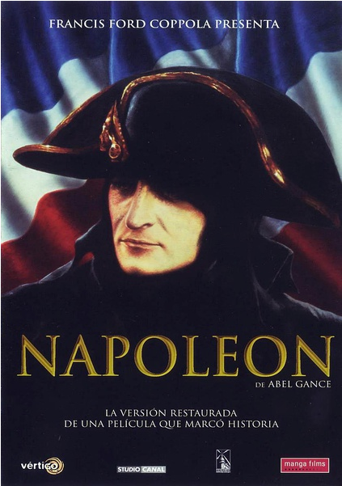
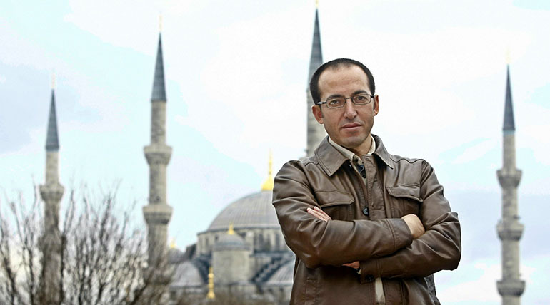
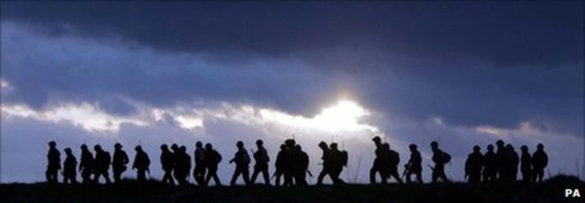
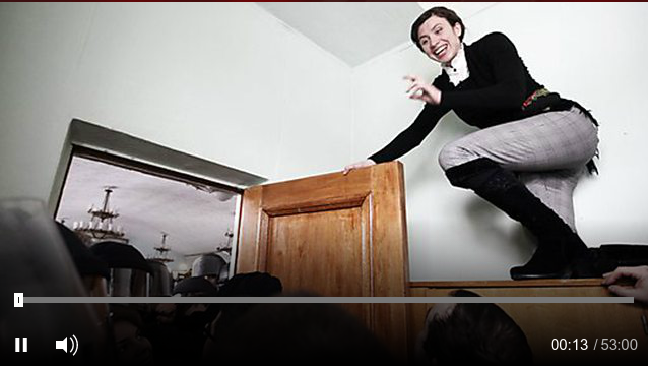
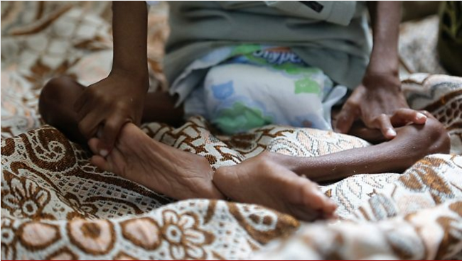
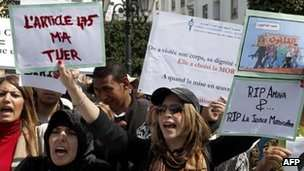
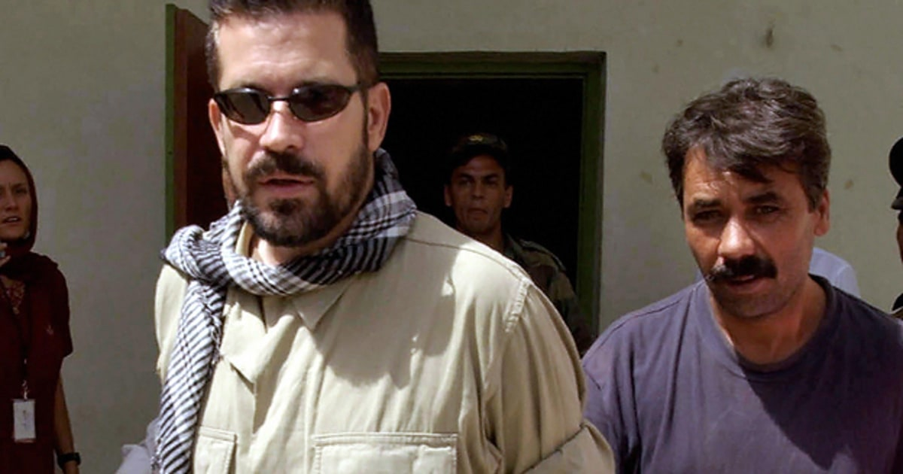

# 默片《拿破侖》

<audio src="file/napoleon.mp3" controls="controls">
Your browser does not support the audio element.
你的瀏覽器不支持音頻播放。請使用chrome科學上網。
</audio>

听写于：2016-12-10	用时：21:39
正确率：94%	错词：5个

提示：红色：错误单词，绿色：补上正确单词，黄色：纠正大小写与标点

* _Words_ worth to be remembered:
    * [爱乐乐团（The _London_ Philharmonia Orchestra](https://zh.wikipedia.org/wiki/%E6%84%9B%E6%A8%82%E7%AE%A1%E5%BC%A6%E6%A8%82%E5%9C%98): 是伦敦的一支管弦乐团。曾几度易名。乐团于1945年在“EMI唱片公司”制作人华尔特·莱格组织下成立，当时只是一支录音专用乐团。从1995年起，皇家节日大厅成了乐团的固定演出场所。
    * composer: `n. 作曲家；著作者`
    * gauge: `n. 标准尺寸；测量仪器；规，表，计；大小，程度；范围；容量；（枪管的）口径 v. 判断；估计；量，测`

## 譯文
本周在伦敦，影院的年度重大事件，暂且不说是本世纪，将会是一部制作长达90年的五个半小时电影。那就是阿贝尔·冈斯的《拿破仑》。这部电影曾经被忽视，如今通过数字修复技术于上周日上映，上映时还配有爱乐管弦乐团的现场演出，由即将80岁并支付了电影修复费用的作曲家卡尔•戴维斯指挥。

我们必须留下一些什么。这就是我们做这部电影的意义。这不是为了纪念，或是因为什么强势的力量让我们促成了这部电影，真正重要的是你做了什么，这才是重要的，你知道吗，他是拿破仑，这就够了。

我们之所以能在21世纪看到《拿破仑》是因为一个追求了60年片段和轨迹的人的奉献。他就是电影侦探凯文·布朗罗。

当我还是个在学校的小男孩时，我就是一个非常热衷于收藏9.5mm电影的人，在8mm占领荧屏之前，这是标准的家庭电影规格。我有一部由法国知识分子让 · 爱普斯坦指导的电影《蒙古的雄狮》，然而我不能忍受它，想要摆脱它。 所以我打电话给我当时买这部电影的图书馆，他们说“不过，不幸的是，我们只剩下一部电影了“。 它就是《法国大革命中的拿破仑·波拿巴》，当时我并不想要它，因为那听起来像一部在教室里放的电影。

---

# 亂局中的伊斯坦布爾(Istanbul)

<audio src="file/istanbul.mp3" controls="controls">
Your browser does not support the audio element.
你的瀏覽器不支持音頻播放。請使用chrome科學上網。
</audio>

听写于：2016-12-11 17:20	用时：22:26
正确率：94%	错词：14个

提示：红色：错误单词，绿色：补上正确单词，黄色：纠正大小写与标点

This week in London, the cinema event of the year - if not the century - has been a five and a half-hour five-and-a-half-hour screening of a film made almost 90 years ago. It is It's Abel Gance's Napoleon, . Digitally restored, once neglected. , it was shown last Sunday with a live performance by the Philharmonia Orchestra conducted by the composer , Carl Davis, who's just turned 80 , and who paid for the restoration. 

We have had to leave something. This would be what we did of significance. It was a kind of, not memorial , 'cause of some sit around. strong–arm, but what's important, what have you donethat's , it's important, you know. That's , it's Napoleon. OK, okay. 

And the reason we could watch Napoleon in the 21st century was the dedication of a man who's pursued the fragments and trails across six decades, . Kevin Brownlow, film detective. 

As a school boy, I was a very enthusiastic film collector , on 9. 5, which was a the standard home movie gage gauge before 8 mm 8mm took over. I had one , called Lion and the Mogols , by the pet of the French intellectuals Jean Epstein . and I couldn't stand it and wanted to get rid of it. So I called the library I bought it from . and they said, well, unfortunately, we we've only got one film left. It's called Napoleon Bonaparte in the French Revolution, which I didn't want . because that sounded like a classroom film.

Today, a fascinating insight into what it's is like to live in Turkey at a time of political repression. The country is in turmoil at the moment. There's been a state of emergency for nearly 6 six months since the attempted coup. According to official figures from the Ministry of Justice. , at least 93,000 people are under investigation for their elegy alleged links to the coup plotters and around 34,000 are facing charges. The last time there was this much political chaos in Turkey was in 1980 , when there was an actual military coup. Burhan Sönmez who' who's known as a novelist these days , was a child at the time. It didn't really hit him until he moved to Istanbul a couple of years later, an idealist 17-year-old idealistic  about to embark on a law degree. 

Of course , I knew Istanbul before I saw that place. All songs, all movies, all stories , and novels and poems about Istanbul in Turkey. Even fairy tales alwaysdirect , there were some scenes things about Istanbul. 

Was it like a fairy tale , when you first arrived? 

Yes, definitely. I was amazed. We got a great train station in Istanbul. , Haydarpaşa train stationis . It's just by the sea. I can claim that it's the most beautiful train station in the world. 

I'll buy itUnbiased, of course. 

Yes. You just come off the train, you see the bus first, Bosphorus and the Europe is just across the sea. It was a wonderful feeling and it was a bit breezy day, . I think it was September. 

And you were about to embark on your adult life, I thinkbasically. 

Oh , yes. Not scared, very much excitedand , a bit nervous, too. Because , coz you don't know what is what's expectingin , that big city, good and bad things.

* _Words_ worth to be remembered:
    * political repression: `政治壓迫,鎮壓`
    * turmoil: `n. 混乱；焦虑；骚动`
    * coup: `n. 成功之举；政变；妙计`
    * attempted[əˈtemptɪd]: `adj. 未遂的，企图的。例句： The attempted coup took place in January. 那场未遂政变发生在1月份。`
    * alleged: `adj. 声称的；被断言的；可疑的 v. allege的过去式和过去分词；宣称`
    * plotter: `n. 阴谋者,计划者;`
    * unbiased: `adj. 公正的；无偏见的`
    * [Bosphorus](https://zh.wikipedia.org/wiki/%E4%BC%8A%E6%96%AF%E5%9D%A6%E5%B8%83%E5%B0%94%E6%B5%B7%E5%B3%A1): `伊斯坦布爾海峽`
    * breezy: `adj. 有微风的；活泼的，明快的，随意的`
    *

## 譯文

我们今天的节目鲜活地反映了政治镇压时期土耳其的生活。那时，国家处于一片混乱。未遂政变发生近六个月以来，国家一直处于非常时刻。司法部官方数字表明，至少93,000人因涉嫌策划政变而接受调查，约34,000人正面临指控。土耳其最近一次政治骚乱发生在上世纪80年代，那是一场真正的军事政变。近来作为小说家而被人熟知的布尔汗·索门茨在那时还是个孩子。直到几年后这个怀揣理想主义的17岁男孩搬到伊斯坦布尔准备去攻读法律学位时，才对动乱的局面真正有所感触。

当然，来这之前我就知道伊斯坦布尔。关于土耳其伊斯坦布尔的各种歌曲、电影、故事、小说和诗歌。甚至一些关于伊斯坦布尔的神话故事。

嗯。你第一次来到这里就觉得它像神话吗？

是的，那当然，令我惊叹。我们来到伊斯坦布尔的一个宏伟的火车站，海达尔帕夏火车站。它就坐落在海边。我敢说它是世界上最美的火车站。

这评价很客观，当然。

是的。一下火车就能看见博斯普鲁斯海峡，而海对面就是欧洲。景色壮美，引人入胜，那天还有些许微风感觉非常棒，我记得当时是9月。

而你正打算开始成年生活。

是的。我不害怕，反而非常兴奋，还有点紧张，因为你不知道这座大城市有什么在等着你，好事还是坏事。

---

# 人性與戰爭

[How soldiers deal with the job of killing](http://www.bbc.com/news/world-13687796)

<audio src="file/soldiers.mp3" controls="controls">
Your browser does not support the audio element.
你的瀏覽器不支持音頻播放。請使用chrome科學上網。
</audio>

听写于：2016-12-12 14:24	用时：20:19
正确率：89%	错词：22个

提示：红色：错误单词，绿色：补上正确单词，黄色：纠正大小写与标点

Ben says he wanted to kill, . But there are others who are very reluctant. In the Second World War, one of the combatants , S. L. A. Marshall observed that many didn't shoot. He wrote a study , called Men Against Fire , in which he concluded that there was a reluctance to kill. There They were what were called non-firers. Fear of killing rather than fear of being killed was, he said, was the most common cause of battle failure. Marshall's methods of research have since been questioned, but the broad conclusion is still accepted by many. : soldiers often simply won't fire. The referent Reverend Dr Giles Fraser's phrases are Fraser lectures on morality and ethics at the academy of the British Ministry of Defense. 

" I think there is there's a deep human reluctance to kill other people. S. L. A. Marshall found that only 15 % to 20% of combatants in history combat infantry were able to fire their weapons on the enemy. And there were 80%, there 80% that were defects or can't change subjects de facto conscientious objectors when they come it came to the point to fire of firing their own weapon. And this I'd say it is extraordinary. At Gettysburg, this is another extraordinary story. There were 27,000 rifles, muskets , left on the field of battle . and 90% of them were loaded. And actually , it was it's because people were not firing their weapons. "

* _Words_ worth to be remembered:
    * Reverend: `adj. （对牧师的尊称，前面与the连用）尊敬的`
    * combatant: `n. 争斗者,战斗员`
    * infantry: `n. 步兵；步兵团`
    * de facto: `（法）实际上的`
    * conscientious:`adj. 认真的；尽责的；本着良心的；小心谨慎的`
    * objector: `n. 反对者；提出异议的人`
    * musket: `n. 步枪；滑膛枪，毛瑟枪`

## 譯文

Ben说他曾经想要杀戮。但也有一些人是被逼无奈才这么做的。二战期间，作为参战人员的S.L.A. Marshall观察到当时很多人都没有开枪。他做了一个名叫《反对战火的人》的研究，在这份报告里他得出的结论是人们不愿意杀戮。这些人叫做不开枪的人。Marshall说害怕杀戮而非害怕被杀其实是战斗失败的最常见的原因。Marshall研究的方法虽然一直遭到质疑，但是他得出的大结论还是被广泛接受，那就是士兵一般不愿开枪。Giles Frasers博士在英国国防部学院做了以道德为主题的演讲。

“我认为人类自内心深处就对杀戮有排斥。S.L.A. Marshall发现战斗步兵队伍中，只有15%到20%的人能够朝敌人开枪。而80%的人在面临开枪那一刻实际上是会产生抵触情绪而不愿意这么做的。我认为这个发现很特别。葛底斯堡的战役也很特别。当时有27000把来复枪和步枪散落在战场上，其中90%的枪都上了膛。实际上这是因为没有人开枪。”

---

# Troublemaker

[Ukraine's Tiny 'Troublemaker'](http://www.bbc.co.uk/programmes/p01s60xs)

<audio src="file/troublemaker.mp3" controls="controls">
Your browser does not support the audio element.
你的瀏覽器不支持音頻播放。請使用chrome科學上網。
</audio>

听写于：2016-12-13 12:04	用时：23:33
正确率：92%	错词：16个

提示：红色：错误单词，绿色：补上正确单词，黄色：纠正大小写与标点

We've been hearing from controversial campaigners who've been making waves across Europe. Today , we go to Ukraine and to Kiev , where clashes between government forces and opposition groups have been the at their most violence violent since the unrest began in November last year. 34-year-old Tetiana Chornovol is an anti-government activist who divides opinion across in the country. As an investigative reporter for opposition websites, she's built a reputation for unusual standsstunts. But in December last year, she became the story herselfm herself when she was brutely brutally attacked after her car was forced off the road. Last month, Outlook's Lucy Ash when went to meet Tetiana and her family in Kiev. 

Wustim has got a scooter with lights on it. , going round and round. He is He's like Tetiana. 

Oh , yes, their personalities are very much alike. 

I've just arrived in the home of Tetiana Chornovol, . In the front room of their house on the outskirts of the capital Kiev. , Tetiana's very determined 3-year-old three-year-old son Wustim has rolled up the carpets carpet so he can whiz above about on with his scooter, watched by his grandma, Natalia. 

I said to myself, 'Tanya, , hold the will wheel straight, . Stay on the road. ' But this car that was reaming ramming me probably cost $40,000. And I realized, realised that if such an expensive car is delivered its mission deliberately smashing into me. , it means that those guys are being paid a lot to kill me.

* _Words_ worth to be remembered:
    * unrest: `n. 动乱，骚乱，不安的状态`
    * stunt: `n. 特技表演；噱头 v. 阻碍，遏制；表演特技; 例句： He used to stunt-drive in acrobatic performances. 他过去常在杂技表演中表演驱车特技。`
    * brutally: `adv. 残忍地，野蛮地，狠狠地；直截了当地；难以忍受地`
    * ramming:`舂实,捣打,打夯,抛砂,夯,压实`
    * deliberatly:`adv. 故意地；从容不迫地`
    * smashing:`adj. 极好的；轰动的；粉碎性的 v. smash的现在分词；粉碎`
    * divide opinion: `指令（一群）人的意见产生分歧。 例句： Airport expansion plans divide opinion. 众人对机场扩建方案看法不一`
    * scooter[ˈsku:tə(r)]: ` n. <英>小型摩托车；（儿童）滑板车。 例句： On the scooter we laughed about the performance.  在摩托车上我们为这场表演哈哈大笑。`
    * whiz[wɪz]: ` vi. 发出飕飕声；<口>高速移动。 例句： They heard bullets continue to whiz over their heads. 他们听到子弹不断在他们头顶上嗖嗖飞过。`
    * 【背景资料】
        1. [Ukraine（乌克兰）](http://baike.baidu.com/link?url=gcz1iRQ83_Hbf8ULWWLoNvXhuTOtvO3IJ4hCx5XZRihxunHNzP-uqKrB9lnIjhm3fzXN1eGLxNpp4G7PCS1TnlGEpalkPopoAygK8OgvttLKJgzX1vxgD8OBgVUEHKS)
          乌克兰位于欧洲东部，是欧洲除俄罗斯外领土面积最大的国家。原苏联15个加盟共和国之一，是仅次于俄罗斯和 哈萨克斯坦的第三大加盟共和国。1991年苏联解体后，乌克兰独立。乌克兰地理位置重要，是欧洲联盟与独联体特别是与俄罗斯地缘政治的交叉点。
        2.  [Kiev（基辅）](http://baike.baidu.com/link?url=3e9EmjsojGCIm2N5XPfOBb9TeAGO_haspCnwGWhQLdn-YDeitY6mPXEJYVavJxNoYLwNe5MS4rijuHLyj2kxO_) 基辅为乌克兰首都，经济、文化中心。位于第聂伯河中游两岸，及其最大支流普里皮亚季河与杰斯纳河汇合处附近。面积 782平方千米，人口约260万，全市分为10个行政区。
        3. [Tetiana Chornovol](http://en.wikipedia.org/wiki/Tetiana_Chornovol)
          Tetiana Mykolayivna Chornovol is a Ukrainian journalist and civic activist, one of the leaders in the ongoing Euromaidan protest campaign. She is famous for investigative reports about corruption in Ukraine, as well as for her adventurous direct actions. On 25 December 2013, Chornovol was the victim of a much published and condemned severe beating.

## 译文
我们听说过那些在欧洲引起轰动而具有争议的活动家们。今天我们将去乌克兰的基辅，那里自去年11月动乱开始，政府势力和反对派组织间的冲突已经达到暴力顶峰。34岁的塔提亚娜·车娜沃尔是一位反政府激进分子，乌克兰人对她看法不一。作为一位反对派网站的调查记者，她以工作中行事出奇冒险而闻名。但是去年12月，塔提亚娜自己成为了冒险故事的主角，她的车被逼驶离了公路，之后遭到残忍的攻击。上个月，Outlook节目的露西·阿什去基辅见到了她和她的家人。

乌斯提姆得到一个带灯的小滑板车，他一圈一圈的（踩着它）走。他很像塔提亚娜。

噢，是的，他们性格非常相像。

我刚到达塔提亚娜在首都基辅的郊外的家。在她家客厅，车娜3岁的儿子乌斯提姆坚决地卷起了地毯，好在房间里踩着滑板车溜来溜去，奶奶纳塔丽娅紧紧盯着他看。

我告诉自己：“汤娅，笔直开。别离开公路。”但撞过来的这辆车大概价值4万美元。于是我意识到，如果这么贵的一辆车故意撞我，肯定有人花了大价钱买我的命。

----

# 也門飢荒

[Yemen Starving](http://www.bbc.co.uk/programmes/n3ct0bxp)

<audio src="file/Yemen.mp3" controls="controls">
Your browser does not support the audio element.
你的瀏覽器不支持音頻播放。請使用chrome科學上網。
</audio>

听写于：2016-12-14 14:14	用时：16:00
正确率：92%	错词：16个

提示：红色：错误单词，绿色：补上正确单词，黄色：纠正大小写与标点

But first , the UN has issued a stock stark warning that an increasing number of children in Yemen face death from hunger because of a the lack of international help. The Wolrd World Health Organisation says more than half of the country's hospital hospitals are not functioning , due to the conflict that's lasted more than 20 months. Houthi rebels and forces ally shut allied to the former President Ali Abdullah Saleh are fighting the internationally recognized recognised government , which is backed by Saudi Arabia. Since the war began, the number of children suffering from malnutrition has risen 3-foldthreefold. Our special correspondent Fergal Keane has traveled travelled to one of the worst-affected  parts of the country. 

 

" It is becoming one of the sounds that defines our time. Another desperate infant in the  a Middle-Eastern war without end. In this room, there are two babies. , Juda who's to my left and she is 4 four months old. , and on the right, on another bed with her mother is Eliane, who's 9 nine months old. They are both chronically malnourished. And as I'm looking at Juda. , this, this tiny face staring at me vacantly . and hands that are, they are too tiny for a child who is 4 who's four months of age. Too tiny. "

* _Words_ worth to be remembered:
    * stark: `adj. 荒凉的；光秃秃的；刻板的；僵硬的；朴实的；完全的 adv. 完全地；明显地`
    * ally to: `与...属一类,与...相似,与...有关系, 同盟`
    * vacantly:`adv. 空虚地,无表情地`

## 譯文
首先，联合国发出了一则严肃的警告：也门越来越多的儿童因缺乏国际援助而面临饿死的危险。世界卫生组织称，由于长达20个月的战乱，也门境内超过半数的医院已经停止工作。胡西族的反政府武装以及和前总统阿拉布都结盟的武装力量联合起来，正在与得到国际认可、并由沙特阿拉伯支持的也门政府交锋。自从开战以来，患上营养不良的儿童数量翻了三倍。我们的特派记者 Fergo Kee 已经前往也门儿童饥饿情况最严重的地区之一。

“（这哭声）也是属于我们的时代的其中一种声音。无休无止的战争，又一个深陷绝望的婴儿。在这则视频中，我左手边的是 Juda, 她四个月大；我右手边的，跟母亲躺在同一张床上的是 Allian, 他九个月大。他们两个都已经长时间营养不良。我此刻正看着 Juda, 这张小脸空洞洞地看着我，而她的手，作为一个四个月大的孩子来说也太小了。实在太小了。”

---

# 強奸不犯法 喪盡天良的摩洛哥法律

[摩洛哥刑法规定强奸犯与受害者结婚可免除刑责，16岁少女自杀一石激起千层浪. Morocco protest against rape-marriage law](http://www.bbc.com/news/world-africa-17416426)

<audio src="file/morocco.mp3" controls="controls">
Your browser does not support the audio element.
你的瀏覽器不支持音頻播放。請使用chrome科學上網。
</audio>

听写于：2016-12-15 12:8	用时：22:26
正确率：92%	错词：20个

提示：红色：错误单词，绿色：补上正确单词，黄色：纠正大小写与标点

Women's right campaign is rights campaigners in Morocco , it have been demonstrated demonstrating in the capital Rabat against the country's rape law laws which allows allow the rapist to marry his victim in order to avoid prosecution. The protesters have been outraged by the suicide of 16-year-old Amina Filali last week after she was severely beaten when she was forced to marry her rapist. Her mother described what happened. 

" He raped my daughter, . He mistreated my daughter. She complained to me that she was mistreated . that she didn't get fed, that he threaten threatened to kill her if she stayed there. I told her to not to be afraid, to be patient, to be very patient. "

The protesters have asked the government to remove a specific article in the penal code , which forces rape victims to marry their rapists , has as a way of defending the families' honorfamily's honour. I called My colleague Julian Marshall and got more details . And my from our correspondent in Rabat , Nora Fakim. 

" But the Moroccan's Moroccans women's association are protesting today , to ask the government to remove the penal code 475 . and to help change mentalities , because for them, it's a waste of life and there could be future Amina Filalis if the government doesn't do anything. "

" And how much supporters support is there for this pressure to remove this article from the penal code. 

? "

" Well, the women's activists are getting a lot of pressure from Moroccans in general. But, but I spoke to them in this morning , and they have been disappointed by the government's reactions reaction so far. , because only 2 two ministers responded . and they are particularly upset at the minister of justice who is defending the judge who forces forced the 15-year-old girl to get married to her rapist. "

* _Words_ worth to be remembered:
    * campainger: `n. 竞选者，活动家；从军者，出征者；老兵`
    * penal code: `刑法典`

## 譯文
摩洛哥的女权运动者在首都拉巴特示威，抗议该国强奸法案。该法律规定，强奸犯可与被害者结婚，以免受刑责。16岁少女阿米娜•费拉利被迫嫁给强奸犯后，于上周遭毒打后自杀身亡，此事件也点燃了抗议者的怒火。阿米娜的妈妈讲述了事情的经过。

“他强奸我女儿，还虐待她。我女儿向我诉苦说他虐待她，不给她东西吃，还威胁说如果她留在家里就杀了她。我告诉她不要害怕，要忍耐，一定要忍下去。”

摩洛哥刑法强迫受害者与强奸犯结婚，以保护家族名誉，抗议者则要求政府废除这项条例。我的同事朱利安•马歇尔与拉巴特记者诺拉•法基姆连线，获知了更多细节。

“摩洛哥妇女联盟今天抗议，要求政府废除刑法475条，并帮助受害者恢复心理状态，因为如果政府不改变现状，对受害者来说就是浪费生命，今后也可能会发生更多类似阿米娜•费拉利的事件。”

“那么这次要求废除刑法相关条例的抗议得到了多少支持？”

“一般来说，妇女运动会受到很多来自摩洛哥人的压力，但我今早与他们交谈，发现他们对政府目前的反应感到失望，因为仅有两名大臣做出回应。而之前法官曾强迫15岁少女嫁给强奸犯，司法部长对此做出的支持也令他们尤为愤慨。”

---

# 輪回轉世

<audio src="file/Buddhist.mp3" controls="controls">
Your browser does not support the audio element.
你的瀏覽器不支持音頻播放。請使用chrome科學上網。
</audio>

听写于：2016-12-16 12:31	用时：28:24
正确率：90%	错词：23个

提示：红色：错误单词，绿色：补上正确单词，黄色：纠正大小写与标点

For Buddhists, god's waiting room is a stepping stone to another life. And to learn more about that, I've come here to the Amaravati Monastery in its peaceful rural setting , near the town of Berkhamsted , north of London. And I gain I'm going to meet the abbot , Ajahn Amaro. 

" Well, from the Buddhist perspective, the things thing that causes the most trouble for us, while we'ar we're alive, or we're dying , is a the habit that of what we all will call clinging or grasping attachment. If you were you're hanging onto on to your possessions, or you're hanging onto on to the regrets that you have . and thinking in terms of the customary Buddist Buddhist pattern that we are of understanding . There is that there's a pattern of past lives and future lives that we are we're all experiencing, so the present life is one of a life large sequence. And so the basic process of Buddhist practice and the underlying current of it is trying to try to end rebirth altogether. "

" I think this is the most fascinating concept. It's very ancient. It emerges within Indian tradition, Buddhist tradition follows it, sick Sikh tradition generally follows it. But what's going on with it? What's the driver? , the driver of reincarnation , as the ideas it developed, was the one that of merit. But this idea of merit of also drives the Jewish , Christian , Islamic world , which is not a reincarnation world. , but it is a world of life, death, judgment, judgement and an afterlife. When in the West, we pick up this concept of reincarnation, we picked pick it up rather positively and joyfully. In actual fact, it's something you just gotta go through and through and through and through , until of course , you gain release. "

* _Words_ worth to be remembered:
    * stepping stone: `垫脚石；跳板；进身之阶 例： The next rock in your path may be a stepping stone. 也许人生路上的下一个绊脚石就是垫脚石。`
    *  hang on to: `紧紧抓住；紧握 例： For most nations, it is a great achievement to hang on to what you already have. 对于大多数国家来说，为了已经拥有的东西而坚持不懈是伟大的成就。`
    * clinging:`adj. 执着的；有黏性的；紧靠着的 v. cling的现在分词；抓紧`
    * grasping: `adj. 贪婪的，贪心的 v. grasp的现在分词；抓住`
    * customary: `adj. 习惯的；通常的`
    * underlying current: `其潜在的趋势`
    * altogether: `adv. 完全地；总共；总而言之`
    * reincarnation: `n. 再赋与肉体，化身，再生，转世，轮回`
    * merit: `n. 优点，价值；功绩；功过 vt. 值得 vi. 应受报答`
    * afterlife:`n. 来世;晚年`
    * joyfully:`adv. 欢喜地;高兴地;快乐地`
    * **in actual fact**: `事實上`

## 譯文

对佛教徒来说，夕阳红的晚年是通向往生的进身之阶。为了深入了解这一点，我来到了伦敦北部靠近巴克汉姆斯特镇的一个宁静偏远的景点——阿玛拉瓦第佛法道场。我将拜见其住持方丈Ajahn Amaro。

“从佛教的视角来看，引起最大麻烦的东西是我们依赖于附属物的习惯，无论我们是生还是死。如果你紧握住你的财富不放，或是放不下过去的悔恨，那么以传统的佛教模式思考，或者说理解我们都在经历着的前世和来世，今生只是一长串序列中的一部分。所以佛教修行的基本过程及其潜在的趋势是终止轮回转世。”

“我认为这是最令人着迷的一个概念。它非常古老，起源于印度教传统，佛教继承了它，锡克教大致上也沿袭了它。然而之后发生了什么？随着理念的发展，行善所得的功德成为了投胎转世的驱动者。这种功德的理念同样推动了不存在投胎再生的犹太教、基督教、伊斯兰教世界，形成了生死、审判以及来世的世界。在西方，我们习得了轮回转世的理念，我们相当正面且愉快地接受了它。事实上，它就是你不断地经历磨难直到最后得到解脱的过程。”

---

# 澤國江山入戰圖

<audio src="file/Taliban.mp3" controls="controls">
Your browser does not support the audio element.
你的瀏覽器不支持音頻播放。請使用chrome科學上網。
</audio>

听写于：2016-12-17 12:07	用时：22:37
正确率：91%	错词：15个

提示：红色：错误单词，绿色：补上正确单词，黄色：纠正大小写与标点

The senior Taliban are surprisingly mild-mannered, . They don't seem to get angry or happy. They believe absolutely that what they are they're doing is right. , but they are they're often naive when it comes to the media. In some ways, Afghanistan is an easy patch. There are no spin doctors here. Afghan men themselves are extremely courteous. Being permitted to carry bags and open doors are my main problems. Unlike any other countries I have country I've visited, I face no sexual harassment. 

For me, the hardest thing to understand is how Afghans afford have fought such a brutal war over so many years. Politeness, hospitality, decency , are the main traits I have I've encountered. 

An insight into this paradox came on a visit to the front linesfrontlines. The fighter fighters showed off one of their rocket launches launchers set up in the middle of a ruined village. The group was a mixture of veterans with 20 years ' experience . and youth youths who are had yet to grow beards, but who nonetheless swaggered. 

After the artillery demonstration, they gave me tea . and then presented me with a bunch of flowers, beautiful , blonde colored bronze-coloured chrysanthemums. It turned out , they've they'd grown the flowers themselves . inside the bunker on which the artillery piece stood. These fighters, who just a couple of months earlier had slid slit throats in vicious hand to hand hand-to-hand fighting, loved growing house plantshouseplants. I wondered if they'd offer you tea before they slid slit your throat.

* _Words_ worth to be remembered:
    * mild-mannered:`adj. 温和的，温柔的`
    * In some ways, Afghanistan **is an easy patch**. There are no **spin doctors** here. Afghan men themselves are extremely **courteous**. 从某些方面来说，阿富汗是**一片安逸之地**，这里没有**专家喉舌**，这里的男人也**彬彬有礼**。
    * spin doctors: `起导向作用者，定调者；(尤指)助选的高级顾问，谋士；公关专家[亦作 spindoctor]`
    * courteous: `adj. 有礼貌的，谦恭的`
    * decency:`n. 得体，体面；正派`
    * nonetheless:`adv. 尽管如此，但是`
    * swaggered: `adj. 时髦的 n. 大摇大摆，趾高气扬；吹嘘，自大；威吓 v. 大摇大摆，趾高气扬；夸耀；吹牛；吓唬`
    * artillery: `n. 火炮，大炮；炮队；炮术`
    * bunch:`n. 群；串；突出物 vt. 使成一串；使打褶 vi. 隆起；打褶；形成一串 n. (Bunch)人名；(英)邦奇`
    * chrysanthemums:`n. 菊花`
    * slit:`n. 切口，裂缝；投币口 v. 切开，撕开`
    * hand-to-hand:`adj. 极接近的；白刃战的；传递到手的`

## 譯文

令我惊讶的是，塔利班高级官员举止非常温和。他们似乎不会生气也不会很开心，对自己所做的事情也深信不疑，但面对媒体时，却显得很天真。从某些方面来说，阿富汗是一片安逸之地，这里没有专家喉舌，这里的男人也彬彬有礼。允许带包以及大门敞开是我遇到的主要问题。但与我去过的其它任何国家不同的是，在这里我从未受到过性骚扰。

我很难想象阿富汗人民经历过这么多年的残酷战争，因为在这里，我感受到的只有礼貌、热情和文明。

在一次前线采访中，我对这一悖论有了深入的观察。战士们向我展示了位于废墟村庄中部的导弹发射装置。塔利班组织成员老少不一，有经验丰富的老兵，也有羽翼未丰的青年，但他们依然气宇轩昂。

火炮展示完毕之后，他们给我递了一杯茶，还送我一束古铜色的菊花。花居然是他们自己在地堡里种的，那片地还残存弹片。几个月前，这些战士还在肉搏战中撕裂别人的喉咙，而他们竟然爱好在室内种植植物。我很好奇，他们在撕裂别人喉咙之前，会不会也递上一杯茶。

---
