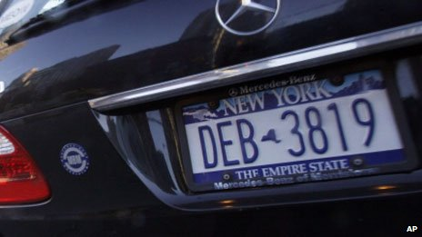

# 生物鍾

听写于：2016-12-26 11:48	用时：20:02
正确率：91%	错词：16个

<audio src="file/biologicalclock.mp3" controls="controls">
Your browser does not support the audio element.
你的瀏覽器不支持音頻播放。請使用chrome科學上網。
</audio>

提示：红色：错误单词，绿色：补上正确单词，黄色：纠正大小写与标点

My guest today, Russell Foster, has the grand title of Professor of Circadian Neuroscience at Oxford University, which is the science speak way of saying he is he's obsessed with clocks . - not the ticking type, but rather our biological clocks and the rhythm rhythms of life. More specifically, he studies the way light controls our internal clocks and circadian rhythms , and works to understand how light and dark affect our well-being. , everything from jetlag jet lag to serious mental health problems. Russell had to fight against strong oppositions opposition from eye experts when he discovered a new way in which animals can detect light. He's written a number of books explaining how these biological clocks control our and other animals' daily lives. Russell, welcome to the Life Scientific. 

Delighted to be here, Jim. 

Now, does our biological makeup mean it's difficult for us to cope with our 24/7 society? 

Well, yes, . We carry with a set us sort of three and a half 3. 5 billion years of evolutionary baggage and buried it embedded within our genome our are the instructions of an the internal clock. It's actually , essentially providing us with a the representation of a day within. And every aspect of our physiology is being  fine-tuned to the varying demands of activity and rest. And we can't easily work against that embedded programme.

* _Words_ worth to be remembered:
    * circadian: `adj. 昼夜节奏的，生理节奏的`
    * jet lag:`phr. 飞行时差综合症；时差反应`
    * makeup:`n. 化妆品，组成，体格，性格，【美】补考，【印】排版`
    * fine-tuned:`v. 调整，微调；使有规则`

## 譯文

我今天的嘉宾罗素·福斯特拥有牛津大学生理节律神经科学教授的头衔，这是一种科学上的说法，即指他对钟着迷——可并非滴答走时的钟，而是我们的生物钟以及生命节奏。更确切地说，他研究光对我们体内的时钟和昼夜节律的控制方式，并努力理解明暗是如何对我们的身心健康产生影响的，从时差反应到严重的心理健康疾病，无所不包。当罗素发现一种动物察觉亮光的新方式时，他不得不对抗来自眼科专家的强烈反对。他已有大量著作解释这些生物时钟是如何控制我们和动物们的日常生活的。罗素，欢迎来到生命科学节目。

很高兴加入你，吉姆。

我们的生物构造是否意味着要应付全天候不停运转的社会很困难？

嗯，是的。我们可以说是身负35亿年的进化重担，而且已把这内部时钟的所有指令根植于我们的基因组中，这就像是我们体内有一个一天的模型。我们生理机能上的各个方面都随着不断变化的活动和休息的需要而做出微调。要与这植根体内的程序作对可不容易。

----

# 零是偶数还是奇数

听写于：2016-12-27 22:40	用时：17:55
正确率：92%	错词：20个

<audio src="file/zero.mp3" controls="controls">
Your browser does not support the audio element.
你的瀏覽器不支持音頻播放。請使用chrome科學上網。
</audio>

提示：红色：错误单词，绿色：补上正确单词，黄色：纠正大小写与标点

But why did Mayor Bloomberg say " even numbers and zero" ? Was it necessary to single zero out? It seemed a little odd to us. So we talked to Dr James Grime of the Millennium Maths Project at Cambridge University in the UK. And he says that the a similar issue came up in France in the 1970s. 

" In 1977, the smog in Paris was so bad that we they had to restrict car use. So they used the same method that they use they're using in New York now. , alternating days for odd and even license plate licence plates' numbers. And the police did not know whether to stop , the zero-numbered  licence plates. Actually, and so they just let them pass because they didn't know whether that it was odd or even. "

" So it seems not everyone is sure . but do mathematicians agree over of whether zero is odd or even? "

" The debate is settled among mathematicians. "

" Mathematicians are agreed that zero is an even number? "

" Zero is an even number, and it will pass every test and every definition of an even number. "

" Well, what are the usual tests or definitions for even numbers? "

" If you take a number and you double it, the result will be an even number. So if you take the number 3 three, and you double it, then you will you'll get 6 six. And 6 six is an even number. So that would will be the definition of even numbers. And zero will pass that test. So if you double zero, you will you'll get zero. But it will pass all the other tests for even numbers as well. If you alternate the even and odd numbers, then zero is between two odd numbers. It's between 1 one and -1. minus one. That's another example of the a test that it would pass. "

* _Words_ worth to be remembered:
    * single out : `挑选出 例句： We all did well, but the teacher singled him out for praise. 我们都做得很好，但老师就表扬了他一个人。`

## 譯文

但是，为什么布隆伯格市长要说“偶数和零”？有必要把零单独拿出来说吗？在我们看来这有点奇怪。于是，我们询问了加入了英国剑桥大学千年数学工程的詹姆斯·格兰姆博士。他说1970年代也有过类似的事例。

“1977年，巴黎弥漫着大量烟雾，空气质量十分糟糕，政府不得不采取措施限制汽车的使用。他们的方法和现在纽约市采用的方法一样，即单双号车辆隔日出行。警察不知道零是单数还是双数，也不知道该不该拦下车牌尾号为零的车辆，只好让这些车开走。”

“看来并不是所有人都确定零是奇数还是偶数，不过，数学家在这个问题上意见统一吗？”

“数学家的看法是一致的。”

“他们认为零是偶数？”

“零是偶数，它通过了所有测试，符合偶数的所有定义。”

“对偶数的测试和定义都有哪些？”

“把一个数乘以2可以得到一个偶数。如果你把3乘以2，结果是6。6就是一个偶数。这就是对偶数的定义。零也符合这条定义。如果你把零乘以2，结果是零。它还通过了其它测试。如果把奇数和偶数间隔排列，零位于两个奇数1和-1之间，它也通过了这项测试。”

---

# Stalker

听写于：2016-12-28 11:45	用时：22:35
正确率：88%	错词：31个

概述：跟踪与骚扰的区别，前者对受害人的精神伤害更大

<audio src="file/stalker.mp3" controls="controls">
Your browser does not support the audio element.
你的瀏覽器不支持音頻播放。請使用chrome科學上網。
</audio>

提示：红色：错误单词，绿色：补上正确单词，黄色：纠正大小写与标点

Stalking steals lives. It stops people from having the normal life sort lifestyle that you and I would've expected. You can would expect, we could go to work, take your kids to school, go about back your, sort of, daily business. It's usually a campaign by somebody who's fix stated fixated and obsessive. , and will, in many casesit stopped , stop at nothing to really shut down the freedom freedoms of the victim. And So it can affect anybody . - we believe it's approximately one in five women and one in ten men. , but we also believe that the figures are underestimated, because quite often, people don't know that they are they're being stalked. When people call us , at the National Stalking Advocacy Service, they want to know what you've called you would call it. 

Yeah, well, let's, I want to put some examples to you. Let's say, I get intensive incessant phone calls, or I have somebody turning up at on my place of work or I get letters I don't want, I get gifts I don't want. Is this the kind of things thing that happens? 

It can be. We talked intense talk in terms of harassment in and stalking . and very often harassments would harassment will be more, sort of, ongoing uses and nuisance behaviour, which can have a significant impact one on somebody's life itself. lifestyle and their mental health. , but really, the difference between stalking and harassment is stalking is more about having a fear of violence . and a significant fear for the victim that means that their freedoms are so significantly changed. , they may have to think about moving house, changing jobs. They may suffer from significant mental health problems, such as PTSDor , depression. , a number of our clients were talked will talk to us about those, sort of, ongoing issues and how they deal with it.

* _Words_ worth to be remembered:
    * fixated:`adj. 念念不忘的;迷恋的 He seems to be fixated on this idea of travelling around the world. 他似乎对周游世界这一想法十分迷恋。`
    * incessant:`adj. 不間斷的, 連續的`
    * nuisance: `n.討厭的人或者事情; 非法妨害`

## 譯文

“跟踪骚扰（stalking）”会剥夺人们原有的生活。它使人们无法继续从前正常的生活方式，如上班、送孩子上学、处理日常事务。跟踪骚扰者异常痴迷且迷恋某人或某事，通常会采取一切手段剥夺受害人的自由。任何人都可能受到跟踪骚扰的危险。我们认为大约每五位女性或十位男性中就有一人遭受到跟踪骚扰，而实际情况可能比这还要严重，因为很多时候人们并不知道自己被跟踪了。当人们电话联系National Stalking Advocacy Service时，他们想要知道你怎么定义那些行为（他们需要你来判断他们是否受到跟踪骚扰）。

这样吧，我说些例子给你。比如说，有人不停给我打电话，有人经常出没在我上班的地方，或者是我经常收到不想要的信件、礼物。跟踪骚扰就是指这类事情吗？

可能是跟踪骚扰（stalking），或是骚扰（harassment）。通常，骚扰（harassment）是持续进行的滋扰行为，会严重影响受害者的生活方式和精神健康。跟踪骚扰和骚扰的区别在于：跟踪骚扰更偏向于造成人对暴力的严重畏惧感，受害者的自由权利受到严重威胁，他们会不得不考虑搬家、换工作。受害者可能患上严重的精神疾病，如创伤后应激障碍（PTSD）或抑郁症。许多客户会告诉我们他们不断面临的问题，以及他们是如何处理的。

---

# 夏威夷的天堂生活

听写于：2016-12-29 10:51	用时：24:29
正确率：90%	错词：22个

[影片《后裔》以度假胜地夏威夷为背景，讲述中年男子处理突如其来的家庭危机，乔治克鲁尼凭借该片获得第69届金球奖最佳男主角。](http://www.nytimes.com/2012/01/16/movies/awardsseason/feisty-host-and-feisty-winners-on-golden-globes.html?_r=1&scp=2&sq=the%20descendants&st=cse)

<audio src="file/hawaii.mp3" controls="controls">
Your browser does not support the audio element.
你的瀏覽器不支持音頻播放。請使用chrome科學上網。
</audio>

提示：红色：错误单词，绿色：补上正确单词，黄色：纠正大小写与标点

Hello, . As family drama , the Descendants collects at the box office. , Director Alexander Payne describes the power of putting George Clooney in a Hawaiian shirt. The Gotham city for zombies and batman White batmen, why Glasgows smiles better. ? A cult film in more than one sense, Martha Marcy May Marlene, Director/Writer Sean Durkin, on his drewlim-like dream-like study of a girl on the run from the a controlling sect. And as baffed on as BAFTA honours John Hurt, he reflects on a the recent role that got away. 

But first, the film that opened strongly in cinemas last weekend, starring George Clooney as a family guy, a father and husbandbut , not perhaps obvious casting, but then the Descendants isn't based on an average family setup. The setting is Hawaii and Clooney's character Matt King, is head of a family trust that owns valuable lands rightfully developmentland, rightful of redevelopment. But he is he's currently dealing with a more immediate crisis. His wife, the mother of their two daughters, aged 17 and 10, is lying in a coma after a boating accident. And all of these are against the backdrop of relentless beauty . - blue sea and waving palms. 

" My friends on the mainland think just because I live in Hawaii, I am live in paradise, . Like a permanent vacation. We are , we're all just out here, sipping my timesMai Tais, checking shaking our hips, and catching weightswaves. Are they insane? Do they think we are immune to life? How can they possibly think our families are less screwed up, ? Our cancers less fatal, ? Our heartaches less painful? How life had Hell, I haven't been on a surfboard in 15 years.

* _Words_ worth to be remembered:
    * box office:`phr. 票房，票房收入；售票处`
    * Glasgows:`格拉斯哥(英国苏格兰西南部港市)`
    * BAFTA:`abbr. （英）电影和电视艺术学院（British Academy of Film and Television Arts）`
    * dream-like:`adj. 梦一般的；朦胧的`
    * sect:`宗派; 邪教`
    * rightful:`adj. 合法的；正当的；公正的；正直的`
    * redevelopment:`再发展,再显影,照相加厚,二次显影`
    * backdrop:`n. 背景幕；背景；交流声`
    * Mai Tai:`迈代鸡尾酒`
    * surfboard:`n. 冲浪板 v. 以冲浪板滑水`

## 譯文

大家好。随着家庭类影片《後裔》在影院上映，导演亚历山大•佩恩向我们展示了穿上夏威夷花衬衫的乔治•克鲁尼的巨大魅力。哥谭镇（指代纽约）的僵尸和蝙蝠侠赫赫有名，可是为什么格拉斯哥（苏格兰西南的城市）更能吸引电影制作人的眼球？ 在各个方面都很邪典（非主流）的影片《双面玛莎》的导演和编剧肖恩•德金向我们讲述了如梦似幻的故事--一个女孩躲避邪教组织魔爪的逃亡之旅。最后，获得英国电影学院杰出贡献奖的老戏骨约翰•赫特回想他最近失之交臂的角色。

不过首先，我们要介绍上周末在影院强势推出的电影《後裔》。主演乔治•克鲁尼以人夫、人父的居家形象示人。虽然演员阵容不是很惊艳，不过影片中的家庭可不一般。影片的背景设在夏威夷，克鲁尼饰演的麦特•金是家庭信托基金的负责人，有大把有待重新开发的地皮。

但是他却被另外一件棘手的事情弄得焦头烂额。他的妻子，也就是他17岁、10岁女儿的母亲坐船时遇到事故，至今昏迷不醒。所有这些令人揪心的事情竟然发生在这美不胜收地方—大海碧蓝澄澈和棕榈树影婆娑。

“内陆的朋友们觉得因为我住在夏威夷，所以我住在天堂。我们好像永远在度假，整天喝着鸡尾酒、跳着草裙舞、去海滩冲浪。他们难道秀逗了吗？他们觉得我们百毒不侵？他们怎么可以觉得我们家的麻烦就比他们的少？我们就算得了绝症也没他们的那么要人命？我们的心就不像他们这么痛？ 苍天啊，我已经有十五年没碰过冲浪板啦。”

---

# 1型糖尿病患者减肥要小心

听写于：2016-12-30 16:37	用时：21:04
正确率：95%	错词：13个

<audio src="file/diabetes.mp3" controls="controls">
Your browser does not support the audio element.
你的瀏覽器不支持音頻播放。請使用chrome科學上網。
</audio>

提示：红色：错误单词，绿色：补上正确单词，黄色：纠正大小写与标点

Really briefly, Khalida, what is Diabulimia? 

A Diabulimia is an umbrella term , where people with Type 1 Diabetes deliberately reduce or admit omit the insulin that they need to be taking relative to the sugars, the blood sugars that they have and to the carbohydrates that they are eating with the aim of keeping their weight down or losing weight. 

When did you first become aware of it? 

Well, I've been working as a psychiatrist with people with diabetes for nearly 15 years at Kings College Hospital. , and I've been seeing it ever since then. 

So it's not new, people have always done it? 

I think it's, I think that's right . That's that there's probably been an element of manipulating the insulin in people who have with Type 1 Diabetes ever since it's probably been invented. And I think what's happening is that we are now getting increasing awareness of it. 

Well, we'll talk about Emma's experiments own experience in a moment. , but Libby, from your point of view as an organization. organisation, just tell us a little bit about the impact of insulin on the body, . What does it do? 

Insulin regulates your blood glucose levels, . Glucose is another word for sugar. So people who don't have Type 1 Diabetes, their pancreas produces the right amount of insulin for the food they eat. For The people who do have Type 1 Diabetes, their bodies aren't making that insulin. , so they have to inject the right amount. So , and they have to work out , exactly how much insulin they need to take for the food that they are eating. 

Now, different people will react to insulin in different ways, will they? 

Different people have different doses of insulin and take it at different times.

* _Words_ worth to be remembered:
    * omit:`v. 遗漏；疏忽；省略；删除`
    *  umbrella term: `涵盖性术语 eg： In prior presentations, this has sometimes been referred to under the umbrella term of 'Semantic Web'. 在先前的介绍中，它有时会在“语义网”这个术语中被提及。`
    * deliberately:`adv.故意地`
    * Diabulimia:`n. （糖尿病患者的）不规律饮食 英英解释： An eating disorder in which a diabetic person attempts to lose weight by regularly omitting insulin injections.`

## 譯文

简单点说，卡莉达，Diabulimia是什么？

Diabulimia是一个涵盖性术语，1型糖尿病患者需要注射与他们的血糖和他们所吃的碳水化合物成一定比例的胰岛素，而为了控制或者减少体重，他们会故意减少胰岛素的注入，或者根本不注射胰岛素。

你第一次注意到这个问题是在什么时候？

嗯，我在国王学院附属医院当精神病医生，我的病人中就有15年糖尿病史的患者，自从那时我就不断看到这种现象。

所以这不是新鲜事，糖尿病患者一直都这么做吗？

可能自从胰岛素被发明出来的时候，就有一个因子在操纵着1型糖尿病患者体内的胰岛素，我觉得这种说法是正确的。我认为我们对它越来越了解了。

那么，过会儿我们将讨论艾玛的亲身经历，但是莉比，作为一个组织，从你的角度，你能给我们稍微讲讲胰岛素对人体的作用吗。它是怎么作用的？

胰岛素调节人体血糖含量。葡萄糖是糖的另一种说法。没有患上1型糖尿病的人们，他们的胰腺会产生与他们所吃食物相当的胰岛素。而1型糖尿病患者，他们的身体不会产生胰岛素，所以他们需要注射等剂量的胰岛素，他们需要正确计算出与他们所吃食物相当的胰岛素剂量。

现在，不同人对胰岛素有不同反应，是吗？

不同人对胰岛素剂量的需求不同，注射次数也不同。

---

# 蓬勃的生活 Life, Animated

[Documentary follows autistic boy obsessed with Disney](http://www.bbc.com/news/entertainment-arts-36671208)

听写于：2016-12-31 10:44	用时：19:00
正确率：95%	错词：12个

概括：《蓬勃的生活》根据Ron Suskind同名小说改编，是一部穿插动画与真实影像的纪录片，体现了自闭症儿童的家庭在照顾特殊孩子上所遭遇的困难。Suskind的儿子Owen三岁时不再说话，Suskind夫妇和Owen两岁的弟弟一直在与自闭症作斗争，想要维系他们与Owen的感情，而此时Owen唯一的爱好就是迪士尼动画电影。

<audio src="file/Owen.mp3" controls="controls">
Your browser does not support the audio element.
你的瀏覽器不支持音頻播放。請使用chrome科學上網。
</audio>

提示：红色：错误单词，绿色：补上正确单词，黄色：纠正大小写与标点

The documentary , Life, Animated illustrates the story not just with clips from the films, but also its own animation. And it travels from Owen's childhood through adolescence into adulthood, and even moving from home. Director , Roger Ross Williams had already begun to film with the family before Ron's book, which is also called Life, Animated, was published. He knew his documentary had to differ from, even go beyond the book, and give voice to a new character in the family drama - Owen's mother. 

Cornelia had never really talked about it. , so, and because Cornel Cornelia is so private. , so for her, every time she would start, I would've told them went to help tell and then have her held tell the story. She would burst into tears. So it was hard to keep her from crying. Cornelia, as a mother, was determined to connect with Owen at any cost. And even when the doctor said, " do not encourage this obsession with Disney. , lock up the television. " , and they did lock up the television for a point in the book. And she said, " no, any way to connect with my son, I'm going to use. " And so, because of that, really, they've sort of started a revolution , in which they called it call affinity therapy. , a new way of connecting with people living with autism through their passions, finding a pathway through their passions. 

Well , I suppose that that's, the key point is that at it, through the their passions, it doesn't have to be Disney. , does it? 

It does not have to be Disney. It can be anything. One kid, his affinity was carnivorous plants.

* _Words_ worth to be remembered:
    * burst into:`闯入；情绪的突然发作`
    * carnivorous:`adj. 食肉的`

---

# 望子成龍

听写于：2017-1-1 10:23	用时：14:03
正确率：93%	错词：16个

概述：许多父母都对自己的孩子寄予厚望，愿意把宝宝的小动作解读为过人的天赋，但是有多少望子女成龙凤的父母能如愿以偿呢？也要有点“舍得孩子才能套着狼”的精神吧。新年BBC第一弹，祝大家元气满满！

<audio src="file/dominique_moceanu.mp3" controls="controls">
Your browser does not support the audio element.
你的瀏覽器不支持音頻播放。請使用chrome科學上網。
</audio>

提示：红色：错误单词，绿色：补上正确单词，黄色：纠正大小写与标点

In 1996, Dominique Moceanu made headlines as the youngest-ever  member of the US Women's gymnastic Gymnastics team to win a gold medal at the Olympic Games. Her parents were from Romania and inspired by the popular Romanian gymnast Nadia Comăneci, they had high ambition ambitions for their daughter. 

My parents had it in their hearts that when they had their first child, I would be a gymnast. And when they immigrated to the United States in 1981. , that desire stayed within their hearts . and so after I was born about 6 six months, they did a test of my strength just for fun. And my parents didn't have a washer or dryer so they hanged hung me from a cloth clothes line to see how long I could hold on to the cloth clothes line. 

My goodness. 

I know. And so my father dad used to always say I it was such enthusiasm: " You held on until the cloth clothes line broke. " But of course , they were there to catch me. , and they said that was really a sign to them that I was gonna be a great real gymnast. And then eventually , I would've started gymnastic would start gymnastics by the age of 3 three in the United States. , and I was put in a tennis class and a gymnastic gymnastics class. And really tennis was great, but I didn't have the love that I immediately had for gymnastics, and really the rest was history from that moment on.

* _Words_ worth to be remembered:
    * make headlines: `出现在头条新闻位置；受到宣扬。 例句： But other software, developments, and trends are sure to make headlines and seduce developers in 2010.  但是其他软件、开发和趋势等在2010年必定会成为开发人员所关注的头条新闻。`

## 譯文
1996年，美国女子体操队史上最年轻的运动员多米尼克·莫西阿努荣获了奥运金牌。她的父母来自罗马尼亚，受到罗马尼亚知名体操运动员纳迪亚·科马内奇的启发，他们对女儿也抱着很高的期望。

我父母打从心里希望自己第一个孩子，也就是我，能成为一名体操运动员。1981年他们移民来美国时，这个愿望就扎根在他们心里。在我6个月大的时候，他们以测试我的力量为乐趣。我家没有洗衣机和烘干机，于是他们把我挂在晾衣绳上，想看看我能在上面坚持多久。

我的天呐。

没错。我父亲过去老说这实在是太令人惊叹了：“你居然坚持到晾衣绳都断了”。当然，他们在那里接着我呢。他们觉得这就在向他们暗示我将来肯定能成为一个真正的体操运动员。而我从三岁起就在美国进行体操训练。我同时学习网球和体操。网球运动确实很棒，但是我不像立刻爱上体操那样喜爱网球，而且从那一刻起，其余都是历史了。

---

# 宗教與食品

听写于：2017-1-2 10:01	用时：21:24
正确率：93%	错词：14个

<audio src="file/religious.mp3" controls="controls">
Your browser does not support the audio element.
你的瀏覽器不支持音頻播放。請使用chrome科學上網。
</audio>

提示：红色：错误单词，绿色：补上正确单词，黄色：纠正大小写与标点

For many people, the Christmas season is the a time for merriment, for eating, for drinking, and for doing everything to excess. If you were you're religious, it might seem to go against what this time of year is all about. , and certainly , there is there's no shortage of church leaders who rail against the commercialization commercialisation of Christmas. Yet a lot of these this conspicuous feasting does have a religious origin. In a moment, we'll hear how many religious holidays were festivals. But first, the link between religion and consumption hasn't gone unnoticed by food companies and retailers. In fact, increasingly we're seeing religious food stuffs, marked as kosher or halal for instance, going mainstream. You can find those marks on a whole range of products now sold in many Western supermarkets. So how did that happen? How did kosher and halal become as mainstream as, say, vegetarianism in the food industry? Elizabeth Hotson went to find out , here in London. 

There was a time when “if you want wanted a bagelyou get , you'd go to a Jew's Jewish bakery. " or a halal butcher for land slaughtered lamb slaughted according to Islamic law. Nowadays supermarket supermarkets stock what were was once considered specialist and rather exotic items. , and savi savvy businesses are taking advantagesadvantage. On a rainy day in London, I took refuge in Gifto . – a Pakistani restaurant to the west of the city.

* _Words_ worth to be remembered:
    * merriment:`n. 欢喜,嬉戏`
    * conspicuous:`adj. 显眼的，明显的，引人注目的`
    * kosher:`adj. 合适的；符合犹太教教规的，干净的`
    * halal:`n. 伊斯兰教律法的合法食物 v. 按伊斯兰教律法屠宰牲畜`
    * savvy:`adj. 有见识的；具有实际知识的  n. 悟性；头脑 v. 理解；懂, 精明`
    * rail/reɪl/: `v. 强烈抗议 例句： It also likes to rail against U.S. support for authoritarian regimes in the Islamic world.  它差点就要责骂美国在伊斯兰世界里支持独裁政体。`
    * take refuge:` 避难；躲避 例句： He is my loving God and my fortress, my stronghold and my deliverer, my shield, in whom I take refuge, who subdues peoples under me.  他是我慈爱的主，我的山寨，我的高台，我的救主，我的盾牌，是我所投靠的。 他使我的百姓服在我以下。`

## 譯文
对大多数人来讲，圣诞季意味着欢乐、大餐、畅饮，总之凡事都要多多益善。如果你信教，可能就与当下的气氛背道而驰了，当然，总不乏宗教领袖们在抵制圣诞节商业化。但这些夸张的盛宴确实有其宗教起源。稍后，我们将听到有多少宗教节日是欢庆的节日。但首先，宗教与消费的二者关系早已被食品公司和零售商们所发现。事实上，我们能看到越来越多的宗教食物，比如标注为犹太或伊斯兰食品，成为主流。在很多西方超市里，都能看到一大批食品包装上印有那些标识。那么这一切是如何演变的？犹太和伊斯兰食品是如何成为食品行业的主流素食主义的？伊丽莎白·霍森在伦敦为我们找寻答案。

曾经有段时间，“如果你想吃贝果，你就去犹太面包房”或想吃清真羔羊肉就去找伊斯兰屠夫。当今，很多超市都贮存曾经那些看似专业性的或异国的商品，精明的商业从中挖掘利益。伦敦的一个阴雨天，我来到城市西边的一家巴基斯坦餐馆Gifto躲雨。

---

# 蛻變

听写于：2017-1-3 11:52	用时：16:56
正确率：94%	错词：12个

<audio src="file/tuibian.mp3" controls="controls">
Your browser does not support the audio element.
你的瀏覽器不支持音頻播放。請使用chrome科學上網。
</audio>

提示：红色：错误单词，绿色：补上正确单词，黄色：纠正大小写与标点

The rate of Chinese urbanization urbanisation over the last few decades has been astonishing. In 1990, a quarter of China's population lived in urban areas. By last year, over half lived in cities . and the rate isn't slowing. The governments government's building cities across the country, hoping to turn farmers into workers and consumers to drive economic growth. Ten years ago, our China editor Carrie Gracie began visiting a rural community , a thousand 1,000 miles southwest of Beijing. She'd She's seen White Horse Village undergo an extraordinary transformation into neon-lit Wuxi New Town. , and that means " extra goodies for some" . 

The tiny 9-year-old nine-year-old and I have been staring at stuff stuffed toys and superheroes for a very long time. 

" Peipei, " I saidsay, " you've got 300 yuan, . You can get whatever you want. Now , what is it that you want? " 

He just keeps smiling up at me helplessly, popping hopping from one spiral sparrow leg to the other. It's already been a long day. We've , which started at 5 a. m. , when the BBC's White Horse Village crew stumbled from our hotel beds and struggled straggled across the new city's city square to get ready for a live interview into the News Night Newsnight programme. We are We're not the earliest people on the square , though, . The pavement on the main road is thickening with farmers from the surrounding hill villages, laying out their vegetables for keen inspection by the city people who were themselves farmers only five minutes ago. In the old days, and the old days here are only 10 ten years old, there was only farming in this valley.

* _Words_ worth to be remembered:
    * hop:`vt. 搭乘  v. 单足跳跃〔跳行〕 vi. 双足或齐足跳行 n. 蹦跳,跳跃；跳舞；一次飞行的距离`
    * sparrow:`n. 麻雀`
    * straggle:`vi. 迷路；落伍，掉队；四散，蔓延 n. 散乱`

## 譯文
中国的城市化在过去几十年发展速度惊人。1990年，1/4的中国人居住在城市。去年，中国已经有超过一半的人是城市居民，而且其增长速度还没有放缓的趋势。为响应政策号召，中国各地纷纷建起城市，此举的目的是促使农民转为工人和消费者，以推动经济的增长。十年前，我们的中国事务主编嘉莉·格雷西走访了位于北京西南1000英里处的一个农村。她目睹白马村经历了非同寻常的转变，现在它已经是一座霓虹灯闪烁的巫溪新城，而这对一些人来说意味着“尽善尽美”。

我和九岁的小佩佩一块盯着毛绒做的玩具和超级英雄，盯了很长的时间。

“佩佩，”我说，“你有300元，可以买任何想要的东西。现在你想要什么？”

他只是无奈地看着我笑，两条小腿交替跳跃着。今天是漫长的一天，早上五点BBC的白马村摄制组就出发，匆忙来到新城市广场，为新闻之夜的现场采访做准备。然而我们并不是最早出现在广场上的人 。来自周围山村的农民早就在主要道路的路面上铺好了他们种的蔬菜，等待着城里人的细心检验，而这些城里人自己不久前也是农民。仅仅十年前，这个山谷唯一仰赖的只有农业。

---

# 企業的社會責任

听写于：2017-1-4 10:8	用时：19:19
正确率：91%	错词：17个

<audio src="file/amazon.mp3" controls="controls">
Your browser does not support the audio element.
你的瀏覽器不支持音頻播放。請使用chrome科學上網。
</audio>

提示：红色：错误单词，绿色：补上正确单词，黄色：纠正大小写与标点

Open any company's annual report and chances are , there will there'll be something about corporate social responsibility. Because we don't just expect the company companies we buy from to be profitable; we expect them to be good corporate citizens, too. , which might explains explain recent news reports that Amazon has quietly appointed a new director of social responsibility. The appointment comes as the online retailer faces mounting criticism over its business practices. A recent article in the New York Times criticized criticised the company for the way it treated its employees. It spoke of a bruising culture and turner back-stabbingthe internal , something Amazon's boss has since insisted it's is not an accurate portrayal. Whatever the case, Christine Bader, Corporate Social Responsibility Campaigner and the former adviser to the UN Secretary General's Special Representative for Business and Human Rights, is now Amazon's Director of Social Responsibility , or CSR. Here , she's speaking to me on our sister programme , Business Matters last year, when I asked her , " what is does CSR actually meant? "

mean. 

 

I think the part of the problem with the way that the  for quote-unquote corporate responsibility felt field has evolved is that no one knows what it means. It could can mean whatever the CEO wants it to mean. It can mean employing employee volunteer programmes. It can mean reducing your greenhouse gas emissions.

* _Words_ worth to be remembered
    * bruising /ˈbruːzɪŋ/: `a.十分激烈的 例： The administration hopes to avoid another bruising battle over civil rights. 政府希望避免因民权问题再次发生激烈冲突。`
    * back-stabbing: `n.伤人暗箭  例句： We weren't really trying to tell anyone that this was Shakespeare, but it is about back-stabbing.  我们真的没打算做一出莎士比亚戏剧，但这确实是关于背后一刀的故事。`
    * portrayal:`n. 描绘，描写；画像`

## 譯文

如果浏览任何一家公司的年报，你都很有可能看到一些关于企业社会责任的内容。这是因为我们不仅仅要求我们所投资的公司盈利能力出众，我们还希望他们是优秀的企业公民。这也可能解释了近期的新闻报道有关亚马逊暗自任命了新高管来负责社会责任。这起任命源于之前这家网络零售商所遭遇的大量有关公司行为的负面批评。纽约时报近期文章批判了该公司对待员工的方式。文章讲道亚马逊的冲突文化和内部中伤，但亚马逊老板坚称这些描述都不确凿。无论真相如何，Christine Bader已经成为现任亚马逊社会责任的负责人，她也是一位企业社会责任支持者，曾任联合国秘书长商业与人权特别代表的顾问。她曾在这里接受我在我们姐妹节目Business Matters的采访，那时我问她企业社会责任到底是什么含义。

我想主要原因是呼吁的核心企业责任领域已经变化，现在没人能说清楚它表示什么。它可以表示CEO所赋予的任何意义。它可以意味着员工志愿项目。它也可以包括削减温室气体排放量。

---

# 布克獎

听写于：2017-1-5 9:35	用时：26:08
正确率：88%	错词：26个

<audio src="file/booker.mp3" controls="controls">
Your browser does not support the audio element.
你的瀏覽器不支持音頻播放。請使用chrome科學上網。
</audio>

提示：红色：错误单词，绿色：补上正确单词，黄色：纠正大小写与标点

But we start with a literary star , - Paul Beatty, the first American ever to win the coveted Man Booker Prize, which is worth of £50,000 and a place on the best-seller  list. The Sellout is a comic novel which is also unusual for a Man Booker winner . - I laughed out loud reading it . - but the subject method matter, which is a set arrow satire of race relations in contemporary America, also struck me as highly appropriate for 2016 in the wake of Trump's election victory, in and the Black Lives Matter campaign. 

Our sinerator's After the narrator's father was killed in a police shootout and his hometown is wiped off the map. , he decides to right the wrong by taking on the a slave and reintroducing segregation, actions that land him in a the Supreme Court. 

This may be hard to believe, coming from a black man. , but I have I've never stolen anything. , never cheated on my taxes or at cards, never snuck into the movies or fail failed to give back the extra change to a drug store drugstore cashierand different , indifferent to the ways of mercantilism and the minimum wage expectations. I've never burgled a houseor , held up a book liquor store, never boarded a crowded bus or subway car, sat the in a seat reserved for the elderly. But here I am, in a cavendish chamber the cavernous chambers of the Supreme Court of the United States of America. ; my car illegally and somewhat ironically parked on Consitution Constitution Avenue. ; my hands cuffed and crossed cross behind my back. ; my right to remain silent long since waved waived and said goodbye to as I sit in the thickly patted a thickly-padded chair that, much like this country, isn't quite as comfortable as it looks.

* _Words_ worth to be remembered:
    * covet:`v. 贪求，觊觎`
    * satire:`n. 讽刺；讽刺文学，讽刺作品`
    * mercantilism:`n. 重商主义；商人本性；商业主义`
    * burgle:`vt. 偷窃，破门盗窃 vi. 偷窃，破门盗窃`
    * cavernous:`adj. 似巨穴的`
    * chamber:`n. 会客室，议事厅；议院；房间；卧室；腔 v. 限制，把…关在室内；装填`
    * waive:`vt. 放弃；搁置`
    * padded:`adj. 有装填垫料的；脚底有厚肉的 v. 填补（pad的过去分词形式）`
    * land sb in： `使某人陷入 Revealing confidential information to a rival company could land you in serious trouble with your boss. 给竞争公司泄露机密信息很可能会让老板使你陷入麻烦`
    * My rights remain silent 米兰达权利： [美国刑事诉讼中的miranda rights——米兰达权利，也就是犯罪嫌疑人保持沉默的权利，是个具有特殊意义的法律制度。“你有权保持沉默。如果你不保持沉默，那么你所说的一切都能够用作为你的呈堂证供。你有权在受审时请一位律师。如果你付不起律师费的话，我们可以给你请一位。你是否完全了解你的上述权利？”这句话就是著名的“米兰达警告”，也称“米兰达告诫”，即犯罪嫌疑人、被告人在被讯问时，有保持沉默和拒绝回答的权利。](https://en.wikipedia.org/wiki/Miranda_warning)

## 譯文

先来介绍的是文学明星保罗·比蒂（Paul Beatty）。他是今年布克文学奖的获得者，也是第一位获此殊奖的美国作家。除了能获得5万英镑奖金外，他的获奖作品也会在畅销书榜占据一席之地。《出卖》（The Sellout，又译《背叛》）是一本幽默小说，这在布克奖获奖历史中并不常见。这本书常使我捧腹大笑。而它以讽刺当代美国的种族关系为题材，我觉得这非常适合2016年这个年份——特朗普赢得大选胜利，及“黑人的命也是命”（Black Lives Matter）的抗议运动都在2016年发生。 在经历了父亲被警察击毙，家乡城市在地图上消失的事件后，小说的叙述者决定通过雇佣奴隶及施行种族隔离制度来纠正这个错误。这些行为最终使他被送上最高法院的法庭。 “这些话从一个黑人口中说出可能难以让人信服。但是我从来没有偷过东西，从来没有偷税漏税，没有在玩牌时出老千，没有偷偷溜进电影院看电影。我每次都把多找的零钱还给药店收银员。我对重商主义的手段并不在意，对最低薪资标准也没有什么期许。我从未入室盗窃，或是抢劫卖酒的商店。我从没在拥挤的公车或地铁上占用老人专用座位。但我还是落得如此下场，在大而“幽深”的美国最高法庭接受审判。我的车非法地、有些讽刺地停在了宪法大道。我的手被手铐铐住，反剪在背后。当我来到法庭，我不再拥有“保持缄默”的权利。我坐的椅子上垫着厚厚的坐垫，但它跟这个国家一样，都只是看着舒服罢了。

---
