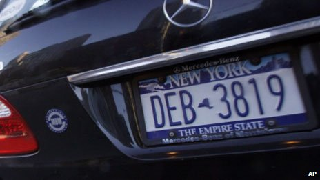

# 生物鍾

听写于：2016-12-26 11:48	用时：20:02
正确率：91%	错词：16个

<audio src="file/biologicalclock.mp3" controls="controls">
Your browser does not support the audio element.
你的瀏覽器不支持音頻播放。請使用chrome科學上網。
</audio>

提示：红色：错误单词，绿色：补上正确单词，黄色：纠正大小写与标点

My guest today, Russell Foster, has the grand title of Professor of Circadian Neuroscience at Oxford University, which is the science speak way of saying he is he's obsessed with clocks . - not the ticking type, but rather our biological clocks and the rhythm rhythms of life. More specifically, he studies the way light controls our internal clocks and circadian rhythms , and works to understand how light and dark affect our well-being. , everything from jetlag jet lag to serious mental health problems. Russell had to fight against strong oppositions opposition from eye experts when he discovered a new way in which animals can detect light. He's written a number of books explaining how these biological clocks control our and other animals' daily lives. Russell, welcome to the Life Scientific. 

Delighted to be here, Jim. 

Now, does our biological makeup mean it's difficult for us to cope with our 24/7 society? 

Well, yes, . We carry with a set us sort of three and a half 3. 5 billion years of evolutionary baggage and buried it embedded within our genome our are the instructions of an the internal clock. It's actually , essentially providing us with a the representation of a day within. And every aspect of our physiology is being  fine-tuned to the varying demands of activity and rest. And we can't easily work against that embedded programme.

* _Words_ worth to be remembered:
    * circadian: `adj. 昼夜节奏的，生理节奏的`
    * jet lag:`phr. 飞行时差综合症；时差反应`
    * makeup:`n. 化妆品，组成，体格，性格，【美】补考，【印】排版`
    * fine-tuned:`v. 调整，微调；使有规则`

## 譯文

我今天的嘉宾罗素·福斯特拥有牛津大学生理节律神经科学教授的头衔，这是一种科学上的说法，即指他对钟着迷——可并非滴答走时的钟，而是我们的生物钟以及生命节奏。更确切地说，他研究光对我们体内的时钟和昼夜节律的控制方式，并努力理解明暗是如何对我们的身心健康产生影响的，从时差反应到严重的心理健康疾病，无所不包。当罗素发现一种动物察觉亮光的新方式时，他不得不对抗来自眼科专家的强烈反对。他已有大量著作解释这些生物时钟是如何控制我们和动物们的日常生活的。罗素，欢迎来到生命科学节目。

很高兴加入你，吉姆。

我们的生物构造是否意味着要应付全天候不停运转的社会很困难？

嗯，是的。我们可以说是身负35亿年的进化重担，而且已把这内部时钟的所有指令根植于我们的基因组中，这就像是我们体内有一个一天的模型。我们生理机能上的各个方面都随着不断变化的活动和休息的需要而做出微调。要与这植根体内的程序作对可不容易。

----

# 零是偶数还是奇数

听写于：2016-12-27 22:40	用时：17:55
正确率：92%	错词：20个

<audio src="file/zero.mp3" controls="controls">
Your browser does not support the audio element.
你的瀏覽器不支持音頻播放。請使用chrome科學上網。
</audio>

提示：红色：错误单词，绿色：补上正确单词，黄色：纠正大小写与标点

But why did Mayor Bloomberg say " even numbers and zero" ? Was it necessary to single zero out? It seemed a little odd to us. So we talked to Dr James Grime of the Millennium Maths Project at Cambridge University in the UK. And he says that the a similar issue came up in France in the 1970s. 

" In 1977, the smog in Paris was so bad that we they had to restrict car use. So they used the same method that they use they're using in New York now. , alternating days for odd and even license plate licence plates' numbers. And the police did not know whether to stop , the zero-numbered  licence plates. Actually, and so they just let them pass because they didn't know whether that it was odd or even. "

" So it seems not everyone is sure . but do mathematicians agree over of whether zero is odd or even? "

" The debate is settled among mathematicians. "

" Mathematicians are agreed that zero is an even number? "

" Zero is an even number, and it will pass every test and every definition of an even number. "

" Well, what are the usual tests or definitions for even numbers? "

" If you take a number and you double it, the result will be an even number. So if you take the number 3 three, and you double it, then you will you'll get 6 six. And 6 six is an even number. So that would will be the definition of even numbers. And zero will pass that test. So if you double zero, you will you'll get zero. But it will pass all the other tests for even numbers as well. If you alternate the even and odd numbers, then zero is between two odd numbers. It's between 1 one and -1. minus one. That's another example of the a test that it would pass. "

* _Words_ worth to be remembered:
    * single out : `挑选出 例句： We all did well, but the teacher singled him out for praise. 我们都做得很好，但老师就表扬了他一个人。`

## 譯文

但是，为什么布隆伯格市长要说“偶数和零”？有必要把零单独拿出来说吗？在我们看来这有点奇怪。于是，我们询问了加入了英国剑桥大学千年数学工程的詹姆斯·格兰姆博士。他说1970年代也有过类似的事例。

“1977年，巴黎弥漫着大量烟雾，空气质量十分糟糕，政府不得不采取措施限制汽车的使用。他们的方法和现在纽约市采用的方法一样，即单双号车辆隔日出行。警察不知道零是单数还是双数，也不知道该不该拦下车牌尾号为零的车辆，只好让这些车开走。”

“看来并不是所有人都确定零是奇数还是偶数，不过，数学家在这个问题上意见统一吗？”

“数学家的看法是一致的。”

“他们认为零是偶数？”

“零是偶数，它通过了所有测试，符合偶数的所有定义。”

“对偶数的测试和定义都有哪些？”

“把一个数乘以2可以得到一个偶数。如果你把3乘以2，结果是6。6就是一个偶数。这就是对偶数的定义。零也符合这条定义。如果你把零乘以2，结果是零。它还通过了其它测试。如果把奇数和偶数间隔排列，零位于两个奇数1和-1之间，它也通过了这项测试。”

---

# Stalker

听写于：2016-12-28 11:45	用时：22:35
正确率：88%	错词：31个

概述：跟踪与骚扰的区别，前者对受害人的精神伤害更大

<audio src="file/stalker.mp3" controls="controls">
Your browser does not support the audio element.
你的瀏覽器不支持音頻播放。請使用chrome科學上網。
</audio>

提示：红色：错误单词，绿色：补上正确单词，黄色：纠正大小写与标点

Stalking steals lives. It stops people from having the normal life sort lifestyle that you and I would've expected. You can would expect, we could go to work, take your kids to school, go about back your, sort of, daily business. It's usually a campaign by somebody who's fix stated fixated and obsessive. , and will, in many casesit stopped , stop at nothing to really shut down the freedom freedoms of the victim. And So it can affect anybody . - we believe it's approximately one in five women and one in ten men. , but we also believe that the figures are underestimated, because quite often, people don't know that they are they're being stalked. When people call us , at the National Stalking Advocacy Service, they want to know what you've called you would call it. 

Yeah, well, let's, I want to put some examples to you. Let's say, I get intensive incessant phone calls, or I have somebody turning up at on my place of work or I get letters I don't want, I get gifts I don't want. Is this the kind of things thing that happens? 

It can be. We talked intense talk in terms of harassment in and stalking . and very often harassments would harassment will be more, sort of, ongoing uses and nuisance behaviour, which can have a significant impact one on somebody's life itself. lifestyle and their mental health. , but really, the difference between stalking and harassment is stalking is more about having a fear of violence . and a significant fear for the victim that means that their freedoms are so significantly changed. , they may have to think about moving house, changing jobs. They may suffer from significant mental health problems, such as PTSDor , depression. , a number of our clients were talked will talk to us about those, sort of, ongoing issues and how they deal with it.

* _Words_ worth to be remembered:
    * fixated:`adj. 念念不忘的;迷恋的 He seems to be fixated on this idea of travelling around the world. 他似乎对周游世界这一想法十分迷恋。`
    * incessant:`adj. 不間斷的, 連續的`
    * nuisance: `n.討厭的人或者事情; 非法妨害`

## 譯文

“跟踪骚扰（stalking）”会剥夺人们原有的生活。它使人们无法继续从前正常的生活方式，如上班、送孩子上学、处理日常事务。跟踪骚扰者异常痴迷且迷恋某人或某事，通常会采取一切手段剥夺受害人的自由。任何人都可能受到跟踪骚扰的危险。我们认为大约每五位女性或十位男性中就有一人遭受到跟踪骚扰，而实际情况可能比这还要严重，因为很多时候人们并不知道自己被跟踪了。当人们电话联系National Stalking Advocacy Service时，他们想要知道你怎么定义那些行为（他们需要你来判断他们是否受到跟踪骚扰）。

这样吧，我说些例子给你。比如说，有人不停给我打电话，有人经常出没在我上班的地方，或者是我经常收到不想要的信件、礼物。跟踪骚扰就是指这类事情吗？

可能是跟踪骚扰（stalking），或是骚扰（harassment）。通常，骚扰（harassment）是持续进行的滋扰行为，会严重影响受害者的生活方式和精神健康。跟踪骚扰和骚扰的区别在于：跟踪骚扰更偏向于造成人对暴力的严重畏惧感，受害者的自由权利受到严重威胁，他们会不得不考虑搬家、换工作。受害者可能患上严重的精神疾病，如创伤后应激障碍（PTSD）或抑郁症。许多客户会告诉我们他们不断面临的问题，以及他们是如何处理的。

---

# 夏威夷的天堂生活

听写于：2016-12-29 10:51	用时：24:29
正确率：90%	错词：22个

[影片《后裔》以度假胜地夏威夷为背景，讲述中年男子处理突如其来的家庭危机，乔治克鲁尼凭借该片获得第69届金球奖最佳男主角。](http://www.nytimes.com/2012/01/16/movies/awardsseason/feisty-host-and-feisty-winners-on-golden-globes.html?_r=1&scp=2&sq=the%20descendants&st=cse)

<audio src="file/hawaii.mp3" controls="controls">
Your browser does not support the audio element.
你的瀏覽器不支持音頻播放。請使用chrome科學上網。
</audio>

提示：红色：错误单词，绿色：补上正确单词，黄色：纠正大小写与标点

Hello, . As family drama , the Descendants collects at the box office. , Director Alexander Payne describes the power of putting George Clooney in a Hawaiian shirt. The Gotham city for zombies and batman White batmen, why Glasgows smiles better. ? A cult film in more than one sense, Martha Marcy May Marlene, Director/Writer Sean Durkin, on his drewlim-like dream-like study of a girl on the run from the a controlling sect. And as baffed on as BAFTA honours John Hurt, he reflects on a the recent role that got away. 

But first, the film that opened strongly in cinemas last weekend, starring George Clooney as a family guy, a father and husbandbut , not perhaps obvious casting, but then the Descendants isn't based on an average family setup. The setting is Hawaii and Clooney's character Matt King, is head of a family trust that owns valuable lands rightfully developmentland, rightful of redevelopment. But he is he's currently dealing with a more immediate crisis. His wife, the mother of their two daughters, aged 17 and 10, is lying in a coma after a boating accident. And all of these are against the backdrop of relentless beauty . - blue sea and waving palms. 

" My friends on the mainland think just because I live in Hawaii, I am live in paradise, . Like a permanent vacation. We are , we're all just out here, sipping my timesMai Tais, checking shaking our hips, and catching weightswaves. Are they insane? Do they think we are immune to life? How can they possibly think our families are less screwed up, ? Our cancers less fatal, ? Our heartaches less painful? How life had Hell, I haven't been on a surfboard in 15 years.

* _Words_ worth to be remembered:
    * box office:`phr. 票房，票房收入；售票处`
    * Glasgows:`格拉斯哥(英国苏格兰西南部港市)`
    * BAFTA:`abbr. （英）电影和电视艺术学院（British Academy of Film and Television Arts）`
    * dream-like:`adj. 梦一般的；朦胧的`
    * sect:`宗派; 邪教`
    * rightful:`adj. 合法的；正当的；公正的；正直的`
    * redevelopment:`再发展,再显影,照相加厚,二次显影`
    * backdrop:`n. 背景幕；背景；交流声`
    * Mai Tai:`迈代鸡尾酒`
    * surfboard:`n. 冲浪板 v. 以冲浪板滑水`

## 譯文

大家好。随着家庭类影片《後裔》在影院上映，导演亚历山大•佩恩向我们展示了穿上夏威夷花衬衫的乔治•克鲁尼的巨大魅力。哥谭镇（指代纽约）的僵尸和蝙蝠侠赫赫有名，可是为什么格拉斯哥（苏格兰西南的城市）更能吸引电影制作人的眼球？ 在各个方面都很邪典（非主流）的影片《双面玛莎》的导演和编剧肖恩•德金向我们讲述了如梦似幻的故事--一个女孩躲避邪教组织魔爪的逃亡之旅。最后，获得英国电影学院杰出贡献奖的老戏骨约翰•赫特回想他最近失之交臂的角色。

不过首先，我们要介绍上周末在影院强势推出的电影《後裔》。主演乔治•克鲁尼以人夫、人父的居家形象示人。虽然演员阵容不是很惊艳，不过影片中的家庭可不一般。影片的背景设在夏威夷，克鲁尼饰演的麦特•金是家庭信托基金的负责人，有大把有待重新开发的地皮。

但是他却被另外一件棘手的事情弄得焦头烂额。他的妻子，也就是他17岁、10岁女儿的母亲坐船时遇到事故，至今昏迷不醒。所有这些令人揪心的事情竟然发生在这美不胜收地方—大海碧蓝澄澈和棕榈树影婆娑。

“内陆的朋友们觉得因为我住在夏威夷，所以我住在天堂。我们好像永远在度假，整天喝着鸡尾酒、跳着草裙舞、去海滩冲浪。他们难道秀逗了吗？他们觉得我们百毒不侵？他们怎么可以觉得我们家的麻烦就比他们的少？我们就算得了绝症也没他们的那么要人命？我们的心就不像他们这么痛？ 苍天啊，我已经有十五年没碰过冲浪板啦。”

---

# 1型糖尿病患者减肥要小心

听写于：2016-12-30 16:37	用时：21:04
正确率：95%	错词：13个

<audio src="file/diabetes.mp3" controls="controls">
Your browser does not support the audio element.
你的瀏覽器不支持音頻播放。請使用chrome科學上網。
</audio>

提示：红色：错误单词，绿色：补上正确单词，黄色：纠正大小写与标点

Really briefly, Khalida, what is Diabulimia? 

A Diabulimia is an umbrella term , where people with Type 1 Diabetes deliberately reduce or admit omit the insulin that they need to be taking relative to the sugars, the blood sugars that they have and to the carbohydrates that they are eating with the aim of keeping their weight down or losing weight. 

When did you first become aware of it? 

Well, I've been working as a psychiatrist with people with diabetes for nearly 15 years at Kings College Hospital. , and I've been seeing it ever since then. 

So it's not new, people have always done it? 

I think it's, I think that's right . That's that there's probably been an element of manipulating the insulin in people who have with Type 1 Diabetes ever since it's probably been invented. And I think what's happening is that we are now getting increasing awareness of it. 

Well, we'll talk about Emma's experiments own experience in a moment. , but Libby, from your point of view as an organization. organisation, just tell us a little bit about the impact of insulin on the body, . What does it do? 

Insulin regulates your blood glucose levels, . Glucose is another word for sugar. So people who don't have Type 1 Diabetes, their pancreas produces the right amount of insulin for the food they eat. For The people who do have Type 1 Diabetes, their bodies aren't making that insulin. , so they have to inject the right amount. So , and they have to work out , exactly how much insulin they need to take for the food that they are eating. 

Now, different people will react to insulin in different ways, will they? 

Different people have different doses of insulin and take it at different times.

* _Words_ worth to be remembered:
    * omit:`v. 遗漏；疏忽；省略；删除`
    *  umbrella term: `涵盖性术语 eg： In prior presentations, this has sometimes been referred to under the umbrella term of 'Semantic Web'. 在先前的介绍中，它有时会在“语义网”这个术语中被提及。`
    * deliberately:`adv.故意地`
    * Diabulimia:`n. （糖尿病患者的）不规律饮食 英英解释： An eating disorder in which a diabetic person attempts to lose weight by regularly omitting insulin injections.`

## 譯文

简单点说，卡莉达，Diabulimia是什么？

Diabulimia是一个涵盖性术语，1型糖尿病患者需要注射与他们的血糖和他们所吃的碳水化合物成一定比例的胰岛素，而为了控制或者减少体重，他们会故意减少胰岛素的注入，或者根本不注射胰岛素。

你第一次注意到这个问题是在什么时候？

嗯，我在国王学院附属医院当精神病医生，我的病人中就有15年糖尿病史的患者，自从那时我就不断看到这种现象。

所以这不是新鲜事，糖尿病患者一直都这么做吗？

可能自从胰岛素被发明出来的时候，就有一个因子在操纵着1型糖尿病患者体内的胰岛素，我觉得这种说法是正确的。我认为我们对它越来越了解了。

那么，过会儿我们将讨论艾玛的亲身经历，但是莉比，作为一个组织，从你的角度，你能给我们稍微讲讲胰岛素对人体的作用吗。它是怎么作用的？

胰岛素调节人体血糖含量。葡萄糖是糖的另一种说法。没有患上1型糖尿病的人们，他们的胰腺会产生与他们所吃食物相当的胰岛素。而1型糖尿病患者，他们的身体不会产生胰岛素，所以他们需要注射等剂量的胰岛素，他们需要正确计算出与他们所吃食物相当的胰岛素剂量。

现在，不同人对胰岛素有不同反应，是吗？

不同人对胰岛素剂量的需求不同，注射次数也不同。
